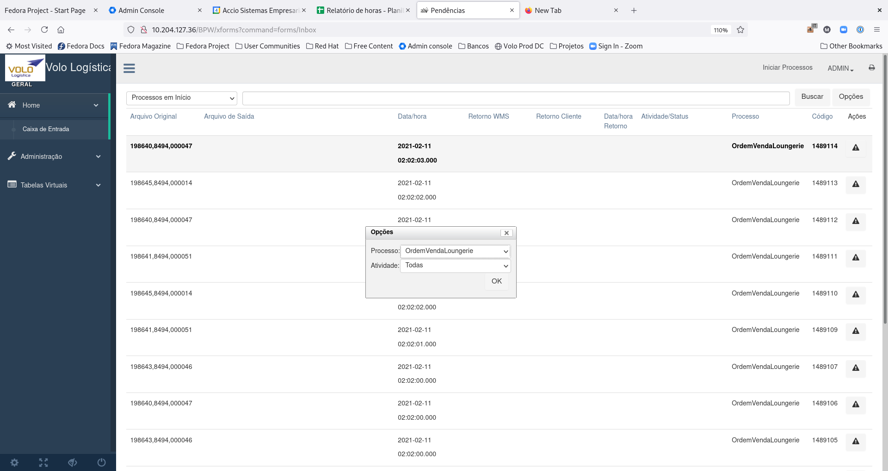
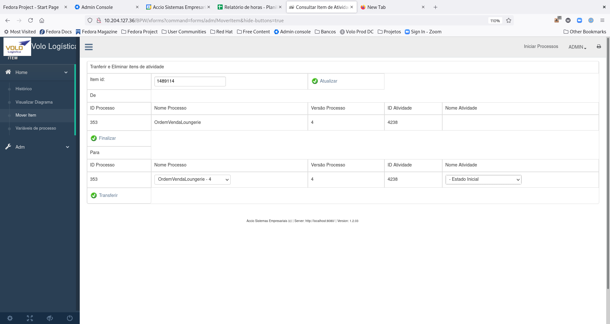
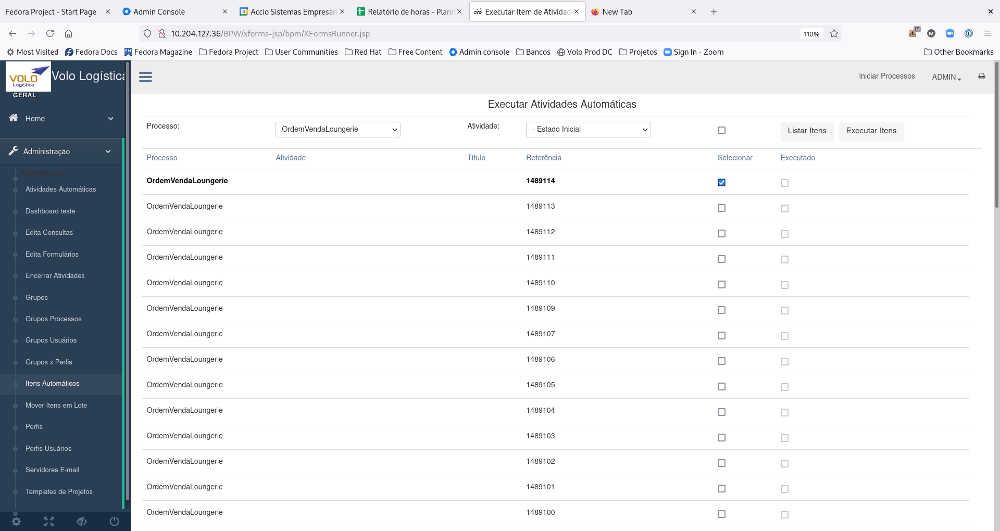

# Localização de Ticket

## Ticket representam as instâncias de processo em execução

# Tem uma referência que pode se repetir em vários processos (chamada referência) 

# Tem um ID único para cada execução de processo (ID_ITEM)

## Padrão para busca de tickets é o meta-dados no campo SEARCH_REF da tabela ITEM

# As chaves são escritas pela aplicação nesse campo separadas por espaço

# A busca é feita por parte dos Strings ou por combinação deles

## No caso de tickets que não geraram meta-dados uma opção é filtrar o processo/atividade para reduzir o escopo e fazer a busca.

# Selecionar o escopo "Tudo" caso precise de atividades automáticas, início e fim de processo.

# Selecionar o escopo "Processos em Início" para atividades paradas no "Start"

# Uma vez selecinado podemos mover o item conforme a necessidade para outro estado.

## Caso a atividade esteja em início de processo ela pode ser também re-executada na tela de executar ítens

