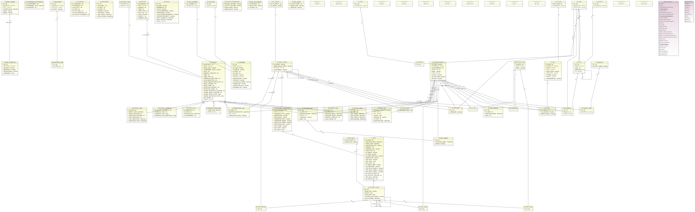

# Classes do Pacote bpm

*  [ACTIVITY](#classe-activity)
			
*  [ACTIVITY_ITEM](#classe-activity_item)
			
*  [ACTIVITY_LOG](#classe-activity_log)
			
*  [ACTIVITY_MSG](#classe-activity_msg)
			
*  [ACTIVITY_PROJ](#classe-activity_proj)
			
*  [ACTIVITY_SCHEDULE](#classe-activity_schedule)
			
*  [ACTIVITY_TYPE](#classe-activity_type)
			
*  [CHKLIST](#classe-chklist)
			
*  [CHKLIST_ITEM](#classe-chklist_item)
			
*  [CHKLIST_INSTANCE](#classe-chklist_instance)
			
*  [COMPONENT_DICTIONARY](#classe-component_dictionary)
			
*  [COMPONENT_REPOSITORY](#classe-component_repository)
			
*  [CONTA](#classe-conta)
			
*  [COUNTERS](#classe-counters)
			
*  [EMAIL_SERVER](#classe-email_server)
			
*  [EMAIL_TEMPLATE](#classe-email_template)
			
*  [EVENT_LOG](#classe-event_log)
			
*  [GER](#classe-ger)
			
*  [GROUP_USERS](#classe-group_users)
			
*  [ITEM](#classe-item)
			
*  [ITEM_PRIORITY](#classe-item_priority)
			
*  [LISTENERS](#classe-listeners)
			
*  [MENSAGENS](#classe-mensagens)
			
*  [MESSAGE_LOG](#classe-message_log)
			
*  [MILESTONE](#classe-milestone)
			
*  [MILESTONE_ITEM](#classe-milestone_item)
			
*  [MSG_CIENTE](#classe-msg_ciente)
			
*  [MURAL](#classe-mural)
			
*  [PROCESS](#classe-process)
			
*  [PROCESS_GROUP](#classe-process_group)
			
*  [PROCESS_PARAMETERS](#classe-process_parameters)
			
*  [PROCESS_ROLE](#classe-process_role)
			
*  [PROCESS_TRANSITION](#classe-process_transition)
			
*  [PROCESS_USER](#classe-process_user)
			
*  [PROCESS_VARS](#classe-process_vars)
			
*  [ROLE_DICTIONARY](#classe-role_dictionary)
			
*  [TIPO_COMP](#classe-tipo_comp)
			
*  [TIPO_LISTENER](#classe-tipo_listener)
			
*  [TIPO_MSG](#classe-tipo_msg)
			
*  [TIPO_VAR](#classe-tipo_var)
			
*  [TP_GER](#classe-tp_ger)
			
*  [TP_GROUP](#classe-tp_group)
			
*  [TRANSITION_LOG](#classe-transition_log)
			
*  [UG_ROLE](#classe-ug_role)
			
*  [UG_VTAB](#classe-ug_vtab)
			
*  [USER_GROUP](#classe-user_group)
			
*  [USER_ROLE](#classe-user_role)
			
*  [VARS_GROUPS](#classe-vars_groups)
			
*  [VARS_ROLES](#classe-vars_roles)
			
*  [VARS_USERS](#classe-vars_users)
			
*  [VCOL](#classe-vcol)
			
*  [VCOLVAL](#classe-vcolval)
			
*  [VDB](#classe-vdb)
			
*  [VDBTABS](#classe-vdbtabs)
			
*  [VDTYPE](#classe-vdtype)
			
*  [VTAB](#classe-vtab)
				
    
## Diagrama de Classes     	
   
            

				
##    Classe ACTIVITY

 

### Lista de Atributos


PK| Nome | Tipo | Obrigatório | FK| Obs
--|------|------|-------------|---|-----------
*| ID_ACTIVITY|NUMERIC| Sim| Não| 
-| NAME|STRING| Não| Não| 
-| ROLE_ALIAS|STRING| Não| Não| 
-| ID_PROCESS | PROCESS | Não | Sim|  
-| COMPONENT_ALIAS|STRING| Não| Não| 
-| COST|NUMERIC| Não| Não| 
-| PERCENT_COMPLETE|NUMERIC| Não| Não| 
-| TERM|NUMERIC| Não| Não| 
-| TERM_TYPE|NUMERIC| Não| Não| 
-| ID_TYPE | ACTIVITY_TYPE | Não | Sim|  
-| IMMEDIATE_EXECUTION|NUMERIC| Não| Não| 
-| LOAD_EXECUTION|NUMERIC| Não| Não| 
-| SIMULTANEOUS_EXECUTION|NUMERIC| Não| Não| 
-| RETRY_INTERVAL|NUMERIC| Não| Não| 
-| RETRY_TIMES|NUMERIC| Não| Não| 
-| EXCEPTION_INTERVAL|NUMERIC| Não| Não| 
-| EXCEPTION_TIMES|NUMERIC| Não| Não| 
-| GLOBAL_EXCEPTION_COUNTER|NUMERIC| Não| Não| 
-| GLOBAL_RETRY_COUNTER|NUMERIC| Não| Não| 
-| GLOBAL_RETRY_STATE|DATE| Não| Não| 
-| GLOBAL_EXCEPTION_STATE|DATE| Não| Não| 
-| EST_HOURS|NUMERIC| Não| Não| 
-| PARAM|STRING| Não| Não| 

### Serviços


Serviço| Método| URL |
-------|-------|-------|
Listar | post | /LoadModelServlet?servlet=br.com.accio.bpm.bpw.servlet.model.ACTIVITYServlet&amp;command=filter|
Incluir | post | /LoadModelServlet?servlet=br.com.accio.bpm.bpw.servlet.model.ACTIVITYServlet&amp;command=insert&amp;table=ACTIVITY|
Imortar | post | /LoadModelServlet?servlet=br.com.accio.bpm.bpw.servlet.model.ACTIVITYServlet&amp;command=batchImport&amp;table=ACTIVITY|
Alterar | post | /LoadModelServlet?servlet=br.com.accio.bpm.bpw.servlet.model.ACTIVITYServlet&amp;command=update&amp;table=ACTIVITY|
Excluir | post | /LoadModelServlet?servlet=br.com.accio.bpm.bpw.servlet.model.ACTIVITYServlet&amp;command=delete&amp;|
batchDelete | post | /LoadModelServlet?servlet=br.com.accio.bpm.bpw.servlet.model.ACTIVITYServlet&amp;command=batchDelete&amp;RecordsPerPage={instance('process_data')/RecordsPerPage}
|

xml para filtros
```xml
<table>
	<filter>
			<ID_ACTIVITY min="" max="" order="Asc"/>
			<NAME contains="" order=""/>
			<ROLE_ALIAS contains="" order=""/>
			<ID_PROCESS in="" order=""/>
			<COMPONENT_ALIAS contains="" order=""/>
			<COST min="" max="" order=""/>
			<PERCENT_COMPLETE min="" max="" order=""/>
			<TERM min="" max="" order=""/>
			<TERM_TYPE min="" max="" order=""/>
			<ID_TYPE in="" order=""/>
			<IMMEDIATE_EXECUTION min="" max="" order=""/>
			<LOAD_EXECUTION min="" max="" order=""/>
			<SIMULTANEOUS_EXECUTION min="" max="" order=""/>
			<RETRY_INTERVAL min="" max="" order=""/>
			<RETRY_TIMES min="" max="" order=""/>
			<EXCEPTION_INTERVAL min="" max="" order=""/>
			<EXCEPTION_TIMES min="" max="" order=""/>
			<GLOBAL_EXCEPTION_COUNTER min="" max="" order=""/>
			<GLOBAL_RETRY_COUNTER min="" max="" order=""/>
			<GLOBAL_RETRY_STATE min="" max="" order=""/>
			<GLOBAL_EXCEPTION_STATE min="" max="" order=""/>
			<EST_HOURS min="" max="" order=""/>
			<PARAM contains="" order=""/>

	</filter>
	<list RecordsPerPage="0" Page="0" Pages="0"/>
	<result success="">
		<error.msg/>
	</result>
</table>
```


xml para CRUD 
```xml
<table>
	<record rowid="">
		<ID_ACTIVITY value=""/>
		<NAME value=""/>
		<ROLE_ALIAS value=""/>
		<ID_PROCESS table="PROCESS">
		<ID_PROCESS value=""/>
		<NAME value=""/>
		</ID_PROCESS>
		<COMPONENT_ALIAS value=""/>
		<COST value=""/>
		<PERCENT_COMPLETE value=""/>
		<TERM value=""/>
		<TERM_TYPE value=""/>
		<ID_TYPE table="ACTIVITY_TYPE">
		<ID_TYPE value=""/>
		<NAME value=""/>
		</ID_TYPE>
		<IMMEDIATE_EXECUTION value=""/>
		<LOAD_EXECUTION value=""/>
		<SIMULTANEOUS_EXECUTION value=""/>
		<RETRY_INTERVAL value=""/>
		<RETRY_TIMES value=""/>
		<EXCEPTION_INTERVAL value=""/>
		<EXCEPTION_TIMES value=""/>
		<GLOBAL_EXCEPTION_COUNTER value=""/>
		<GLOBAL_RETRY_COUNTER value=""/>
		<GLOBAL_RETRY_STATE value=""/>
		<GLOBAL_EXCEPTION_STATE value=""/>
		<EST_HOURS value=""/>
		<PARAM value=""/>
		<delete value= "false"/>
	</record>

	<result success="">
		<error.msg/>
	</result>
</table>
```	
				
##    Classe ACTIVITY_ITEM

 

### Lista de Atributos


PK| Nome | Tipo | Obrigatório | FK| Obs
--|------|------|-------------|---|-----------
*| ID_ITEM|NUMERIC| Sim| Não| 
*| ID_ACTIVITY | ACTIVITY | Sim | Sim|  
-| RETRY_STATE|DATE| Não| Não| 
-| RETRY_COUNTER|NUMERIC| Não| Não| 
-| EXCEPTION_COUNTER|NUMERIC| Não| Não| 
-| FIRST_EXECUTED|NUMERIC| Não| Não| 
-| LAST_EXECUTION|DATE| Não| Não| 
-| EXCEPTION_STATE|DATE| Não| Não| 

### Serviços


Serviço| Método| URL 
-------|-------|------		
Listar | post | /LoadModelServlet?servlet=br.com.accio.bpm.bpw.servlet.model.ACTIVITY_ITEMServlet&amp;command=filter
Incluir | post | /LoadModelServlet?servlet=br.com.accio.bpm.bpw.servlet.model.ACTIVITY_ITEMServlet&amp;command=insert&amp;table=ACTIVITY_ITEM
Imortar | post | /LoadModelServlet?servlet=br.com.accio.bpm.bpw.servlet.model.ACTIVITY_ITEMServlet&amp;command=batchImport&amp;table=ACTIVITY_ITEM
Alterar | post | /LoadModelServlet?servlet=br.com.accio.bpm.bpw.servlet.model.ACTIVITY_ITEMServlet&amp;command=update&amp;table=ACTIVITY_ITEM
Excluir | post | /LoadModelServlet?servlet=br.com.accio.bpm.bpw.servlet.model.ACTIVITY_ITEMServlet&amp;command=delete&amp;
batchDelete | post | /LoadModelServlet?servlet=br.com.accio.bpm.bpw.servlet.model.ACTIVITY_ITEMServlet&amp;command=batchDelete&amp;RecordsPerPage={instance('process_data')/RecordsPerPage}


xml para filtros
```xml
<table>
	<filter>
			<ID_ITEM min="" max="" order="Asc"/>
			<ID_ACTIVITY in="" order="Asc"/>
			<RETRY_STATE min="" max="" order=""/>
			<RETRY_COUNTER min="" max="" order=""/>
			<EXCEPTION_COUNTER min="" max="" order=""/>
			<FIRST_EXECUTED min="" max="" order=""/>
			<LAST_EXECUTION min="" max="" order=""/>
			<EXCEPTION_STATE min="" max="" order=""/>

	</filter>
	<list RecordsPerPage="0" Page="0" Pages="0"/>
	<result success="">
		<error.msg/>
	</result>
</table>
```


xml para CRUD 
```xml
<table>
	<record rowid="">
		<ID_ITEM value=""/>
		<ID_ACTIVITY table="ACTIVITY">
		<ID_ACTIVITY value=""/>
		<NAME value=""/>
		</ID_ACTIVITY>
		<RETRY_STATE value=""/>
		<RETRY_COUNTER value=""/>
		<EXCEPTION_COUNTER value=""/>
		<FIRST_EXECUTED value=""/>
		<LAST_EXECUTION value=""/>
		<EXCEPTION_STATE value=""/>
		<delete value= "false"/>
	</record>

	<result success="">
		<error.msg/>
	</result>
</table>
```	
				
##    Classe ACTIVITY_LOG

 

### Lista de Atributos


PK| Nome | Tipo | Obrigatório | FK| Obs
--|------|------|-------------|---|-----------
*| ID_LOG|NUMERIC| Sim| Não| 
-| ID_ACTIVITY | ACTIVITY | Não | Sim|  
-| ID_ITEM|NUMERIC| Não| Não| 
-| ID_USER | PROCESS_USER | Não | Sim|  
-| DATETIME_BEGIN|DATE| Não| Não| 
-| DATETIME_FINISH|DATE| Não| Não| 
-| PERCENT_COMPLETE|NUMERIC| Não| Não| 
-| ALOC_HOURS|NUMERIC| Não| Não| 

### Serviços


Serviço| Método| URL 
-------|-------|------		
Listar | post | /LoadModelServlet?servlet=br.com.accio.bpm.bpw.servlet.model.ACTIVITY_LOGServlet&amp;command=filter
Incluir | post | /LoadModelServlet?servlet=br.com.accio.bpm.bpw.servlet.model.ACTIVITY_LOGServlet&amp;command=insert&amp;table=ACTIVITY_LOG
Imortar | post | /LoadModelServlet?servlet=br.com.accio.bpm.bpw.servlet.model.ACTIVITY_LOGServlet&amp;command=batchImport&amp;table=ACTIVITY_LOG
Alterar | post | /LoadModelServlet?servlet=br.com.accio.bpm.bpw.servlet.model.ACTIVITY_LOGServlet&amp;command=update&amp;table=ACTIVITY_LOG
Excluir | post | /LoadModelServlet?servlet=br.com.accio.bpm.bpw.servlet.model.ACTIVITY_LOGServlet&amp;command=delete&amp;
batchDelete | post | /LoadModelServlet?servlet=br.com.accio.bpm.bpw.servlet.model.ACTIVITY_LOGServlet&amp;command=batchDelete&amp;RecordsPerPage={instance('process_data')/RecordsPerPage}


xml para filtros
```xml
<table>
	<filter>
			<ID_LOG min="" max="" order="Asc"/>
			<ID_ACTIVITY in="" order=""/>
			<ID_ITEM min="" max="" order=""/>
			<ID_USER in="" order=""/>
			<DATETIME_BEGIN min="" max="" order=""/>
			<DATETIME_FINISH min="" max="" order=""/>
			<PERCENT_COMPLETE min="" max="" order=""/>
			<ALOC_HOURS min="" max="" order=""/>

	</filter>
	<list RecordsPerPage="0" Page="0" Pages="0"/>
	<result success="">
		<error.msg/>
	</result>
</table>
```


xml para CRUD 
```xml
<table>
	<record rowid="">
		<ID_LOG value=""/>
		<ID_ACTIVITY table="ACTIVITY">
		<ID_ACTIVITY value=""/>
		<NAME value=""/>
		</ID_ACTIVITY>
		<ID_ITEM value=""/>
		<ID_USER table="PROCESS_USER">
		<ID_USER value=""/>
		<NAME value=""/>
		</ID_USER>
		<DATETIME_BEGIN value=""/>
		<DATETIME_FINISH value=""/>
		<PERCENT_COMPLETE value=""/>
		<ALOC_HOURS value=""/>
		<delete value= "false"/>
	</record>

	<result success="">
		<error.msg/>
	</result>
</table>
```	
				
##    Classe ACTIVITY_MSG

 

### Lista de Atributos


PK| Nome | Tipo | Obrigatório | FK| Obs
--|------|------|-------------|---|-----------
*| ID|NUMERIC| Sim| Não| 
-| ID_ACTIVITY | ACTIVITY | Não | Sim|  
-| ID_ITEM|NUMERIC| Não| Não| 
-| ID_USER | PROCESS_USER | Não | Sim|  
-| DATETIME_INSERT|DATE| Não| Não| 
-| QREADS|NUMERIC| Não| Não| 
-| CONTEUDO|STRING| Não| Não| 
-| LEVEL|NUMERIC| Não| Não| 

### Serviços


Serviço| Método| URL 
-------|-------|------		
Listar | post | /LoadModelServlet?servlet=br.com.accio.bpm.bpw.servlet.model.ACTIVITY_MSGServlet&amp;command=filter
Incluir | post | /LoadModelServlet?servlet=br.com.accio.bpm.bpw.servlet.model.ACTIVITY_MSGServlet&amp;command=insert&amp;table=ACTIVITY_MSG
Imortar | post | /LoadModelServlet?servlet=br.com.accio.bpm.bpw.servlet.model.ACTIVITY_MSGServlet&amp;command=batchImport&amp;table=ACTIVITY_MSG
Alterar | post | /LoadModelServlet?servlet=br.com.accio.bpm.bpw.servlet.model.ACTIVITY_MSGServlet&amp;command=update&amp;table=ACTIVITY_MSG
Excluir | post | /LoadModelServlet?servlet=br.com.accio.bpm.bpw.servlet.model.ACTIVITY_MSGServlet&amp;command=delete&amp;
batchDelete | post | /LoadModelServlet?servlet=br.com.accio.bpm.bpw.servlet.model.ACTIVITY_MSGServlet&amp;command=batchDelete&amp;RecordsPerPage={instance('process_data')/RecordsPerPage}


xml para filtros
```xml
<table>
	<filter>
			<ID min="" max="" order="Asc"/>
			<ID_ACTIVITY in="" order=""/>
			<ID_ITEM min="" max="" order=""/>
			<ID_USER in="" order=""/>
			<DATETIME_INSERT min="" max="" order=""/>
			<QREADS min="" max="" order=""/>
			<CONTEUDO contains="" order=""/>
			<LEVEL min="" max="" order=""/>

	</filter>
	<list RecordsPerPage="0" Page="0" Pages="0"/>
	<result success="">
		<error.msg/>
	</result>
</table>
```


xml para CRUD 
```xml
<table>
	<record rowid="">
		<ID value=""/>
		<ID_ACTIVITY table="ACTIVITY">
		<ID_ACTIVITY value=""/>
		<NAME value=""/>
		</ID_ACTIVITY>
		<ID_ITEM value=""/>
		<ID_USER table="PROCESS_USER">
		<ID_USER value=""/>
		<NAME value=""/>
		</ID_USER>
		<DATETIME_INSERT value=""/>
		<QREADS value=""/>
		<CONTEUDO value=""/>
		<LEVEL value=""/>
		<delete value= "false"/>
	</record>

	<result success="">
		<error.msg/>
	</result>
</table>
```	
				
##    Classe ACTIVITY_PROJ

 

### Lista de Atributos


PK| Nome | Tipo | Obrigatório | FK| Obs
--|------|------|-------------|---|-----------
*| ID_PROJ|NUMERIC| Sim| Não| 
-| ID_ACTIVITY | ACTIVITY | Não | Sim|  
-| ID_ITEM|NUMERIC| Não| Não| 
-| ID_USER | PROCESS_USER | Não | Sim|  
-| PROJ_BEGIN|DATE| Não| Não| 
-| PROJ_ASSIGN|DATE| Não| Não| 
-| PROJ_FINISH|DATE| Não| Não| 
-| PROJ_RELEASE|DATE| Não| Não| 

### Serviços


Serviço| Método| URL 
-------|-------|------		
Listar | post | /LoadModelServlet?servlet=br.com.accio.bpm.bpw.servlet.model.ACTIVITY_PROJServlet&amp;command=filter
Incluir | post | /LoadModelServlet?servlet=br.com.accio.bpm.bpw.servlet.model.ACTIVITY_PROJServlet&amp;command=insert&amp;table=ACTIVITY_PROJ
Imortar | post | /LoadModelServlet?servlet=br.com.accio.bpm.bpw.servlet.model.ACTIVITY_PROJServlet&amp;command=batchImport&amp;table=ACTIVITY_PROJ
Alterar | post | /LoadModelServlet?servlet=br.com.accio.bpm.bpw.servlet.model.ACTIVITY_PROJServlet&amp;command=update&amp;table=ACTIVITY_PROJ
Excluir | post | /LoadModelServlet?servlet=br.com.accio.bpm.bpw.servlet.model.ACTIVITY_PROJServlet&amp;command=delete&amp;
batchDelete | post | /LoadModelServlet?servlet=br.com.accio.bpm.bpw.servlet.model.ACTIVITY_PROJServlet&amp;command=batchDelete&amp;RecordsPerPage={instance('process_data')/RecordsPerPage}


xml para filtros
```xml
<table>
	<filter>
			<ID_PROJ min="" max="" order="Asc"/>
			<ID_ACTIVITY in="" order=""/>
			<ID_ITEM min="" max="" order=""/>
			<ID_USER in="" order=""/>
			<PROJ_BEGIN min="" max="" order=""/>
			<PROJ_ASSIGN min="" max="" order=""/>
			<PROJ_FINISH min="" max="" order=""/>
			<PROJ_RELEASE min="" max="" order=""/>

	</filter>
	<list RecordsPerPage="0" Page="0" Pages="0"/>
	<result success="">
		<error.msg/>
	</result>
</table>
```


xml para CRUD 
```xml
<table>
	<record rowid="">
		<ID_PROJ value=""/>
		<ID_ACTIVITY table="ACTIVITY">
		<ID_ACTIVITY value=""/>
		<NAME value=""/>
		</ID_ACTIVITY>
		<ID_ITEM value=""/>
		<ID_USER table="PROCESS_USER">
		<ID_USER value=""/>
		<NAME value=""/>
		</ID_USER>
		<PROJ_BEGIN value=""/>
		<PROJ_ASSIGN value=""/>
		<PROJ_FINISH value=""/>
		<PROJ_RELEASE value=""/>
		<delete value= "false"/>
	</record>

	<result success="">
		<error.msg/>
	</result>
</table>
```	
				
##    Classe ACTIVITY_SCHEDULE

 

### Lista de Atributos


PK| Nome | Tipo | Obrigatório | FK| Obs
--|------|------|-------------|---|-----------
*| ID_ACTIVITY_SCHEDULE|NUMERIC| Sim| Não| 
-| ID_ACTIVITY | ACTIVITY | Não | Sim|  
-| SCHEDULE_TYPE|NUMERIC| Não| Não| 
-| SCHEDULE_TIME|UNKNOWN| Não| Não| 
-| SCHEDULE_LAST_EXECUTION|UNKNOWN| Não| Não| 

### Serviços


Serviço| Método| URL 
-------|-------|------		
Listar | post | /LoadModelServlet?servlet=br.com.accio.bpm.bpw.servlet.model.ACTIVITY_SCHEDULEServlet&amp;command=filter
Incluir | post | /LoadModelServlet?servlet=br.com.accio.bpm.bpw.servlet.model.ACTIVITY_SCHEDULEServlet&amp;command=insert&amp;table=ACTIVITY_SCHEDULE
Imortar | post | /LoadModelServlet?servlet=br.com.accio.bpm.bpw.servlet.model.ACTIVITY_SCHEDULEServlet&amp;command=batchImport&amp;table=ACTIVITY_SCHEDULE
Alterar | post | /LoadModelServlet?servlet=br.com.accio.bpm.bpw.servlet.model.ACTIVITY_SCHEDULEServlet&amp;command=update&amp;table=ACTIVITY_SCHEDULE
Excluir | post | /LoadModelServlet?servlet=br.com.accio.bpm.bpw.servlet.model.ACTIVITY_SCHEDULEServlet&amp;command=delete&amp;
batchDelete | post | /LoadModelServlet?servlet=br.com.accio.bpm.bpw.servlet.model.ACTIVITY_SCHEDULEServlet&amp;command=batchDelete&amp;RecordsPerPage={instance('process_data')/RecordsPerPage}


xml para filtros
```xml
<table>
	<filter>
			<ID_ACTIVITY_SCHEDULE min="" max="" order="Asc"/>
			<ID_ACTIVITY in="" order=""/>
			<SCHEDULE_TYPE min="" max="" order=""/>
			<SCHEDULE_TIME order=""/>
			<SCHEDULE_LAST_EXECUTION order=""/>

	</filter>
	<list RecordsPerPage="0" Page="0" Pages="0"/>
	<result success="">
		<error.msg/>
	</result>
</table>
```


xml para CRUD 
```xml
<table>
	<record rowid="">
		<ID_ACTIVITY_SCHEDULE value=""/>
		<ID_ACTIVITY table="ACTIVITY">
		<ID_ACTIVITY value=""/>
		<NAME value=""/>
		</ID_ACTIVITY>
		<SCHEDULE_TYPE value=""/>
		<SCHEDULE_TIME value=""/>
		<SCHEDULE_LAST_EXECUTION value=""/>
		<delete value= "false"/>
	</record>

	<result success="">
		<error.msg/>
	</result>
</table>
```	
				
##    Classe ACTIVITY_TYPE

 

### Lista de Atributos


PK| Nome | Tipo | Obrigatório | FK| Obs
--|------|------|-------------|---|-----------
*| ID_TYPE|NUMERIC| Sim| Não| 
-| NAME|STRING| Não| Não| 

### Serviços


Serviço| Método| URL 
-------|-------|------		
Listar | post | /LoadModelServlet?servlet=br.com.accio.bpm.bpw.servlet.model.ACTIVITY_TYPEServlet&amp;command=filter
Incluir | post | /LoadModelServlet?servlet=br.com.accio.bpm.bpw.servlet.model.ACTIVITY_TYPEServlet&amp;command=insert&amp;table=ACTIVITY_TYPE
Imortar | post | /LoadModelServlet?servlet=br.com.accio.bpm.bpw.servlet.model.ACTIVITY_TYPEServlet&amp;command=batchImport&amp;table=ACTIVITY_TYPE
Alterar | post | /LoadModelServlet?servlet=br.com.accio.bpm.bpw.servlet.model.ACTIVITY_TYPEServlet&amp;command=update&amp;table=ACTIVITY_TYPE
Excluir | post | /LoadModelServlet?servlet=br.com.accio.bpm.bpw.servlet.model.ACTIVITY_TYPEServlet&amp;command=delete&amp;
batchDelete | post | /LoadModelServlet?servlet=br.com.accio.bpm.bpw.servlet.model.ACTIVITY_TYPEServlet&amp;command=batchDelete&amp;RecordsPerPage={instance('process_data')/RecordsPerPage}


xml para filtros
```xml
<table>
	<filter>
			<ID_TYPE min="" max="" order="Asc"/>
			<NAME contains="" order=""/>

	</filter>
	<list RecordsPerPage="0" Page="0" Pages="0"/>
	<result success="">
		<error.msg/>
	</result>
</table>
```


xml para CRUD 
```xml
<table>
	<record rowid="">
		<ID_TYPE value=""/>
		<NAME value=""/>
		<delete value= "false"/>
	</record>

	<result success="">
		<error.msg/>
	</result>
</table>
```	
				
##    Classe CHKLIST

 

### Lista de Atributos


PK| Nome | Tipo | Obrigatório | FK| Obs
--|------|------|-------------|---|-----------
*| ID|NUMERIC| Sim| Não| 
-| ACTIVITY_NAME|STRING| Sim| Não| 

### Serviços


Serviço| Método| URL 
-------|-------|------		
Listar | post | /LoadModelServlet?servlet=br.com.accio.bpm.bpw.servlet.model.CHKLISTServlet&amp;command=filter
Incluir | post | /LoadModelServlet?servlet=br.com.accio.bpm.bpw.servlet.model.CHKLISTServlet&amp;command=insert&amp;table=CHKLIST
Imortar | post | /LoadModelServlet?servlet=br.com.accio.bpm.bpw.servlet.model.CHKLISTServlet&amp;command=batchImport&amp;table=CHKLIST
Alterar | post | /LoadModelServlet?servlet=br.com.accio.bpm.bpw.servlet.model.CHKLISTServlet&amp;command=update&amp;table=CHKLIST
Excluir | post | /LoadModelServlet?servlet=br.com.accio.bpm.bpw.servlet.model.CHKLISTServlet&amp;command=delete&amp;
batchDelete | post | /LoadModelServlet?servlet=br.com.accio.bpm.bpw.servlet.model.CHKLISTServlet&amp;command=batchDelete&amp;RecordsPerPage={instance('process_data')/RecordsPerPage}


xml para filtros
```xml
<table>
	<filter>
			<ID min="" max="" order="Asc"/>
			<ACTIVITY_NAME contains="" order=""/>

	</filter>
	<list RecordsPerPage="0" Page="0" Pages="0"/>
	<result success="">
		<error.msg/>
	</result>
</table>
```


xml para CRUD 
```xml
<table>
	<record rowid="">
		<ID value=""/>
		<ACTIVITY_NAME value=""/>
		<delete value= "false"/>
	</record>

	<result success="">
		<error.msg/>
	</result>
</table>
```	
				
##    Classe CHKLIST_ITEM

 

### Lista de Atributos


PK| Nome | Tipo | Obrigatório | FK| Obs
--|------|------|-------------|---|-----------
*| ID|NUMERIC| Sim| Sim| 
-| DESCRICAO|STRING| Não| Não| 
-| ID | CHKLIST | Não | Sim|  

### Serviços


Serviço| Método| URL 
-------|-------|------		
Listar | post | /LoadModelServlet?servlet=br.com.accio.bpm.bpw.servlet.model.CHKLIST_ITEMServlet&amp;command=filter
Incluir | post | /LoadModelServlet?servlet=br.com.accio.bpm.bpw.servlet.model.CHKLIST_ITEMServlet&amp;command=insert&amp;table=CHKLIST_ITEM
Imortar | post | /LoadModelServlet?servlet=br.com.accio.bpm.bpw.servlet.model.CHKLIST_ITEMServlet&amp;command=batchImport&amp;table=CHKLIST_ITEM
Alterar | post | /LoadModelServlet?servlet=br.com.accio.bpm.bpw.servlet.model.CHKLIST_ITEMServlet&amp;command=update&amp;table=CHKLIST_ITEM
Excluir | post | /LoadModelServlet?servlet=br.com.accio.bpm.bpw.servlet.model.CHKLIST_ITEMServlet&amp;command=delete&amp;
batchDelete | post | /LoadModelServlet?servlet=br.com.accio.bpm.bpw.servlet.model.CHKLIST_ITEMServlet&amp;command=batchDelete&amp;RecordsPerPage={instance('process_data')/RecordsPerPage}


xml para filtros
```xml
<table>
	<filter>
			<ID min="" max="" order="Asc"/>
			<DESCRICAO contains="" order=""/>
			<CHKLIST_ID in="" order=""/>

	</filter>
	<list RecordsPerPage="0" Page="0" Pages="0"/>
	<result success="">
		<error.msg/>
	</result>
</table>
```


xml para CRUD 
```xml
<table>
	<record rowid="">
		<ID value=""/>
		<DESCRICAO value=""/>
		<CHKLIST_ID table="CHKLIST">
		<ID value=""/>
		<ACTIVITY_NAME value=""/>
		</CHKLIST_ID>
		<delete value= "false"/>
	</record>

	<result success="">
		<error.msg/>
	</result>
</table>
```	
				
##    Classe CHKLIST_INSTANCE

 

### Lista de Atributos


PK| Nome | Tipo | Obrigatório | FK| Obs
--|------|------|-------------|---|-----------
*| ID|NUMERIC| Sim| Sim| 
-| ID | CHKLIST_ITEM | Não | Sim|  
-| ID | PROCESS_USER | Não | Sim|  
-| ID_ITEM|NUMERIC| Não| Não| 
-| CHECKED|BOOLEAN| Não| Não| 
-| CHECK_DATE|DATE| Não| Não| 

### Serviços


Serviço| Método| URL 
-------|-------|------		
Listar | post | /LoadModelServlet?servlet=br.com.accio.bpm.bpw.servlet.model.CHKLIST_INSTANCEServlet&amp;command=filter
Incluir | post | /LoadModelServlet?servlet=br.com.accio.bpm.bpw.servlet.model.CHKLIST_INSTANCEServlet&amp;command=insert&amp;table=CHKLIST_INSTANCE
Imortar | post | /LoadModelServlet?servlet=br.com.accio.bpm.bpw.servlet.model.CHKLIST_INSTANCEServlet&amp;command=batchImport&amp;table=CHKLIST_INSTANCE
Alterar | post | /LoadModelServlet?servlet=br.com.accio.bpm.bpw.servlet.model.CHKLIST_INSTANCEServlet&amp;command=update&amp;table=CHKLIST_INSTANCE
Excluir | post | /LoadModelServlet?servlet=br.com.accio.bpm.bpw.servlet.model.CHKLIST_INSTANCEServlet&amp;command=delete&amp;
batchDelete | post | /LoadModelServlet?servlet=br.com.accio.bpm.bpw.servlet.model.CHKLIST_INSTANCEServlet&amp;command=batchDelete&amp;RecordsPerPage={instance('process_data')/RecordsPerPage}


xml para filtros
```xml
<table>
	<filter>
			<ID min="" max="" order="Asc"/>
			<CHKLIST_ITEM_ID in="" order=""/>
			<PROCESS_USER_ID in="" order=""/>
			<ID_ITEM min="" max="" order=""/>
			<CHECKED value="" order=""/>
			<CHECK_DATE min="" max="" order=""/>

	</filter>
	<list RecordsPerPage="0" Page="0" Pages="0"/>
	<result success="">
		<error.msg/>
	</result>
</table>
```


xml para CRUD 
```xml
<table>
	<record rowid="">
		<ID value=""/>
		<CHKLIST_ITEM_ID table="CHKLIST_ITEM">
		<ID value=""/>
		<DESCRICAO value=""/>
		</CHKLIST_ITEM_ID>
		<PROCESS_USER_ID table="PROCESS_USER">
		<ID_USER value=""/>
		<NAME value=""/>
		</PROCESS_USER_ID>
		<ID_ITEM value=""/>
		<CHECKED value=""/>
		<CHECK_DATE value=""/>
		<delete value= "false"/>
	</record>

	<result success="">
		<error.msg/>
	</result>
</table>
```	
				
##    Classe COMPONENT_DICTIONARY

 

### Lista de Atributos


PK| Nome | Tipo | Obrigatório | FK| Obs
--|------|------|-------------|---|-----------
*| ID_COMPONENT|NUMERIC| Sim| Não| 
*| COMPONENT_ALIAS|STRING| Sim| Não| 
*| ID_PROCESS|NUMERIC| Sim| Não| 

### Serviços


Serviço| Método| URL 
-------|-------|------		
Listar | post | /LoadModelServlet?servlet=br.com.accio.bpm.bpw.servlet.model.COMPONENT_DICTIONARYServlet&amp;command=filter
Incluir | post | /LoadModelServlet?servlet=br.com.accio.bpm.bpw.servlet.model.COMPONENT_DICTIONARYServlet&amp;command=insert&amp;table=COMPONENT_DICTIONARY
Imortar | post | /LoadModelServlet?servlet=br.com.accio.bpm.bpw.servlet.model.COMPONENT_DICTIONARYServlet&amp;command=batchImport&amp;table=COMPONENT_DICTIONARY
Alterar | post | /LoadModelServlet?servlet=br.com.accio.bpm.bpw.servlet.model.COMPONENT_DICTIONARYServlet&amp;command=update&amp;table=COMPONENT_DICTIONARY
Excluir | post | /LoadModelServlet?servlet=br.com.accio.bpm.bpw.servlet.model.COMPONENT_DICTIONARYServlet&amp;command=delete&amp;
batchDelete | post | /LoadModelServlet?servlet=br.com.accio.bpm.bpw.servlet.model.COMPONENT_DICTIONARYServlet&amp;command=batchDelete&amp;RecordsPerPage={instance('process_data')/RecordsPerPage}


xml para filtros
```xml
<table>
	<filter>
			<ID_COMPONENT min="" max="" order="Asc"/>
			<COMPONENT_ALIAS contains="" order="Asc"/>
			<ID_PROCESS min="" max="" order="Asc"/>

	</filter>
	<list RecordsPerPage="0" Page="0" Pages="0"/>
	<result success="">
		<error.msg/>
	</result>
</table>
```


xml para CRUD 
```xml
<table>
	<record rowid="">
		<ID_COMPONENT value=""/>
		<COMPONENT_ALIAS value=""/>
		<ID_PROCESS value=""/>
		<delete value= "false"/>
	</record>

	<result success="">
		<error.msg/>
	</result>
</table>
```	
				
##    Classe COMPONENT_REPOSITORY

 

### Lista de Atributos


PK| Nome | Tipo | Obrigatório | FK| Obs
--|------|------|-------------|---|-----------
*| ID_COMPONENT|NUMERIC| Sim| Não| 
-| NAME|STRING| Não| Não| 
-| INTERFACE_TYPE|STRING| Não| Não| 
-| DESCRIPTION|STRING| Não| Não| 
-| EXECUTABLE|STRING| Não| Não| 
-| PARAMETER_DATA|STRING| Não| Não| 
-| PARAMETER_MODEL|STRING| Não| Não| 
-| EXECUTION_MODEL|STRING| Não| Não| 
-| EXECUTION_DATA|STRING| Não| Não| 
-| DOC_MODEL|STRING| Não| Não| 
-| DOC_DATA|STRING| Não| Não| 
-| XML_DATA|STRING| Não| Não| 
-| ID_GROUP | GROUP_USERS | Não | Sim|  
-| LAST_CHANGE|DATE| Não| Não| 

### Serviços


Serviço| Método| URL 
-------|-------|------		
Listar | post | /LoadModelServlet?servlet=br.com.accio.bpm.bpw.servlet.model.COMPONENT_REPOSITORYServlet&amp;command=filter
Incluir | post | /LoadModelServlet?servlet=br.com.accio.bpm.bpw.servlet.model.COMPONENT_REPOSITORYServlet&amp;command=insert&amp;table=COMPONENT_REPOSITORY
Imortar | post | /LoadModelServlet?servlet=br.com.accio.bpm.bpw.servlet.model.COMPONENT_REPOSITORYServlet&amp;command=batchImport&amp;table=COMPONENT_REPOSITORY
Alterar | post | /LoadModelServlet?servlet=br.com.accio.bpm.bpw.servlet.model.COMPONENT_REPOSITORYServlet&amp;command=update&amp;table=COMPONENT_REPOSITORY
Excluir | post | /LoadModelServlet?servlet=br.com.accio.bpm.bpw.servlet.model.COMPONENT_REPOSITORYServlet&amp;command=delete&amp;
batchDelete | post | /LoadModelServlet?servlet=br.com.accio.bpm.bpw.servlet.model.COMPONENT_REPOSITORYServlet&amp;command=batchDelete&amp;RecordsPerPage={instance('process_data')/RecordsPerPage}


xml para filtros
```xml
<table>
	<filter>
			<ID_COMPONENT min="" max="" order="Asc"/>
			<NAME contains="" order=""/>
			<INTERFACE_TYPE contains="" order=""/>
			<DESCRIPTION contains="" order=""/>
			<EXECUTABLE contains="" order=""/>
			<PARAMETER_DATA contains="" order=""/>
			<PARAMETER_MODEL contains="" order=""/>
			<EXECUTION_MODEL contains="" order=""/>
			<EXECUTION_DATA contains="" order=""/>
			<DOC_MODEL contains="" order=""/>
			<DOC_DATA contains="" order=""/>
			<XML_DATA contains="" order=""/>
			<ID_GROUP in="" order=""/>
			<LAST_CHANGE min="" max="" order=""/>

	</filter>
	<list RecordsPerPage="0" Page="0" Pages="0"/>
	<result success="">
		<error.msg/>
	</result>
</table>
```


xml para CRUD 
```xml
<table>
	<record rowid="">
		<ID_COMPONENT value=""/>
		<NAME value=""/>
		<INTERFACE_TYPE value=""/>
		<DESCRIPTION value=""/>
		<EXECUTABLE value=""/>
		<PARAMETER_DATA value=""/>
		<PARAMETER_MODEL value=""/>
		<EXECUTION_MODEL value=""/>
		<EXECUTION_DATA value=""/>
		<DOC_MODEL value=""/>
		<DOC_DATA value=""/>
		<XML_DATA value=""/>
		<ID_GROUP table="GROUP_USERS">
		<ID_GROUP value=""/>
		<NAME_GROUP_USERS value=""/>
		</ID_GROUP>
		<LAST_CHANGE value=""/>
		<delete value= "false"/>
	</record>

	<result success="">
		<error.msg/>
	</result>
</table>
```	
				
##    Classe CONTA

 

### Lista de Atributos


PK| Nome | Tipo | Obrigatório | FK| Obs
--|------|------|-------------|---|-----------
*| ID_CONTA|NUMERIC| Sim| Não| 
-| CD_USUARIO|STRING| Não| Não| 
-| SENHA_INICIAL|STRING| Não| Não| 
-| ID_GERENCIADOR | GER | Não | Sim|  
-| ID_USER | PROCESS_USER | Não | Sim|  

### Serviços


Serviço| Método| URL 
-------|-------|------		
Listar | post | /LoadModelServlet?servlet=br.com.accio.bpm.bpw.servlet.model.CONTAServlet&amp;command=filter
Incluir | post | /LoadModelServlet?servlet=br.com.accio.bpm.bpw.servlet.model.CONTAServlet&amp;command=insert&amp;table=CONTA
Imortar | post | /LoadModelServlet?servlet=br.com.accio.bpm.bpw.servlet.model.CONTAServlet&amp;command=batchImport&amp;table=CONTA
Alterar | post | /LoadModelServlet?servlet=br.com.accio.bpm.bpw.servlet.model.CONTAServlet&amp;command=update&amp;table=CONTA
Excluir | post | /LoadModelServlet?servlet=br.com.accio.bpm.bpw.servlet.model.CONTAServlet&amp;command=delete&amp;
batchDelete | post | /LoadModelServlet?servlet=br.com.accio.bpm.bpw.servlet.model.CONTAServlet&amp;command=batchDelete&amp;RecordsPerPage={instance('process_data')/RecordsPerPage}


xml para filtros
```xml
<table>
	<filter>
			<ID_CONTA min="" max="" order="Asc"/>
			<CD_USUARIO contains="" order=""/>
			<SENHA_INICIAL contains="" order=""/>
			<GER_ID_GERENCIADOR in="" order=""/>
			<PROCESS_USER_ID_USER in="" order=""/>

	</filter>
	<list RecordsPerPage="0" Page="0" Pages="0"/>
	<result success="">
		<error.msg/>
	</result>
</table>
```


xml para CRUD 
```xml
<table>
	<record rowid="">
		<ID_CONTA value=""/>
		<CD_USUARIO value=""/>
		<SENHA_INICIAL value=""/>
		<GER_ID_GERENCIADOR table="GER">
		<ID_GER value=""/>
		<DESCRICAO value=""/>
		</GER_ID_GERENCIADOR>
		<PROCESS_USER_ID_USER table="PROCESS_USER">
		<ID_USER value=""/>
		<NAME value=""/>
		</PROCESS_USER_ID_USER>
		<delete value= "false"/>
	</record>

	<result success="">
		<error.msg/>
	</result>
</table>
```	
				
##    Classe COUNTERS

 

### Lista de Atributos


PK| Nome | Tipo | Obrigatório | FK| Obs
--|------|------|-------------|---|-----------
*| ID_COUNTERS|NUMERIC| Sim| Não| 
-| ID_PROCESS|NUMERIC| Não| Não| 
-| ID_ACTIVITY|NUMERIC| Não| Não| 
-| ID_ITEM|NUMERIC| Não| Não| 
-| ID_LOG_ITEM|NUMERIC| Não| Não| 
-| ID_LOG_TRANSICAO|NUMERIC| Não| Não| 
-| ID_ACTIVITY_SCHEDULE|NUMERIC| Não| Não| 

### Serviços


Serviço| Método| URL 
-------|-------|------		
Listar | post | /LoadModelServlet?servlet=br.com.accio.bpm.bpw.servlet.model.COUNTERSServlet&amp;command=filter
Incluir | post | /LoadModelServlet?servlet=br.com.accio.bpm.bpw.servlet.model.COUNTERSServlet&amp;command=insert&amp;table=COUNTERS
Imortar | post | /LoadModelServlet?servlet=br.com.accio.bpm.bpw.servlet.model.COUNTERSServlet&amp;command=batchImport&amp;table=COUNTERS
Alterar | post | /LoadModelServlet?servlet=br.com.accio.bpm.bpw.servlet.model.COUNTERSServlet&amp;command=update&amp;table=COUNTERS
Excluir | post | /LoadModelServlet?servlet=br.com.accio.bpm.bpw.servlet.model.COUNTERSServlet&amp;command=delete&amp;
batchDelete | post | /LoadModelServlet?servlet=br.com.accio.bpm.bpw.servlet.model.COUNTERSServlet&amp;command=batchDelete&amp;RecordsPerPage={instance('process_data')/RecordsPerPage}


xml para filtros
```xml
<table>
	<filter>
			<ID_COUNTERS min="" max="" order="Asc"/>
			<ID_PROCESS min="" max="" order=""/>
			<ID_ACTIVITY min="" max="" order=""/>
			<ID_ITEM min="" max="" order=""/>
			<ID_LOG_ITEM min="" max="" order=""/>
			<ID_LOG_TRANSICAO min="" max="" order=""/>
			<ID_ACTIVITY_SCHEDULE min="" max="" order=""/>

	</filter>
	<list RecordsPerPage="0" Page="0" Pages="0"/>
	<result success="">
		<error.msg/>
	</result>
</table>
```


xml para CRUD 
```xml
<table>
	<record rowid="">
		<ID_COUNTERS value=""/>
		<ID_PROCESS value=""/>
		<ID_ACTIVITY value=""/>
		<ID_ITEM value=""/>
		<ID_LOG_ITEM value=""/>
		<ID_LOG_TRANSICAO value=""/>
		<ID_ACTIVITY_SCHEDULE value=""/>
		<delete value= "false"/>
	</record>

	<result success="">
		<error.msg/>
	</result>
</table>
```	
				
##    Classe EMAIL_SERVER

 

### Lista de Atributos


PK| Nome | Tipo | Obrigatório | FK| Obs
--|------|------|-------------|---|-----------
*| ID|NUMERIC| Sim| Não| 
-| DESCRICAO|STRING| Não| Não| 
-| SMTP|STRING| Não| Não| 
-| AUTENTICACAO|BOOLEAN| Não| Não| 
-| LOGIN|STRING| Não| Não| 
-| SENHA|STRING| Não| Não| 

### Serviços


Serviço| Método| URL 
-------|-------|------		
Listar | post | /LoadModelServlet?servlet=br.com.accio.bpm.bpw.servlet.model.EMAIL_SERVERServlet&amp;command=filter
Incluir | post | /LoadModelServlet?servlet=br.com.accio.bpm.bpw.servlet.model.EMAIL_SERVERServlet&amp;command=insert&amp;table=EMAIL_SERVER
Imortar | post | /LoadModelServlet?servlet=br.com.accio.bpm.bpw.servlet.model.EMAIL_SERVERServlet&amp;command=batchImport&amp;table=EMAIL_SERVER
Alterar | post | /LoadModelServlet?servlet=br.com.accio.bpm.bpw.servlet.model.EMAIL_SERVERServlet&amp;command=update&amp;table=EMAIL_SERVER
Excluir | post | /LoadModelServlet?servlet=br.com.accio.bpm.bpw.servlet.model.EMAIL_SERVERServlet&amp;command=delete&amp;
batchDelete | post | /LoadModelServlet?servlet=br.com.accio.bpm.bpw.servlet.model.EMAIL_SERVERServlet&amp;command=batchDelete&amp;RecordsPerPage={instance('process_data')/RecordsPerPage}


xml para filtros
```xml
<table>
	<filter>
			<ID min="" max="" order="Asc"/>
			<DESCRICAO contains="" order=""/>
			<SMTP contains="" order=""/>
			<AUTENTICACAO value="" order=""/>
			<LOGIN contains="" order=""/>
			<SENHA contains="" order=""/>

	</filter>
	<list RecordsPerPage="0" Page="0" Pages="0"/>
	<result success="">
		<error.msg/>
	</result>
</table>
```


xml para CRUD 
```xml
<table>
	<record rowid="">
		<ID value=""/>
		<DESCRICAO value=""/>
		<SMTP value=""/>
		<AUTENTICACAO value=""/>
		<LOGIN value=""/>
		<SENHA value=""/>
		<delete value= "false"/>
	</record>

	<result success="">
		<error.msg/>
	</result>
</table>
```	
				
##    Classe EMAIL_TEMPLATE

 

### Lista de Atributos


PK| Nome | Tipo | Obrigatório | FK| Obs
--|------|------|-------------|---|-----------
*| ID|NUMERIC| Sim| Não| 
-| DESCRICAO|STRING| Não| Não| 
-| ASSUNTO|STRING| Não| Não| 
-| REMETENTE|STRING| Não| Não| 
-| DESTINATARIO|STRING| Não| Não| 
-| CONTEUDO|STRING| Não| Não| 
-| SERVIDOR | EMAIL_SERVER | Não | Sim|  

### Serviços


Serviço| Método| URL 
-------|-------|------		
Listar | post | /LoadModelServlet?servlet=br.com.accio.bpm.bpw.servlet.model.EMAIL_TEMPLATEServlet&amp;command=filter
Incluir | post | /LoadModelServlet?servlet=br.com.accio.bpm.bpw.servlet.model.EMAIL_TEMPLATEServlet&amp;command=insert&amp;table=EMAIL_TEMPLATE
Imortar | post | /LoadModelServlet?servlet=br.com.accio.bpm.bpw.servlet.model.EMAIL_TEMPLATEServlet&amp;command=batchImport&amp;table=EMAIL_TEMPLATE
Alterar | post | /LoadModelServlet?servlet=br.com.accio.bpm.bpw.servlet.model.EMAIL_TEMPLATEServlet&amp;command=update&amp;table=EMAIL_TEMPLATE
Excluir | post | /LoadModelServlet?servlet=br.com.accio.bpm.bpw.servlet.model.EMAIL_TEMPLATEServlet&amp;command=delete&amp;
batchDelete | post | /LoadModelServlet?servlet=br.com.accio.bpm.bpw.servlet.model.EMAIL_TEMPLATEServlet&amp;command=batchDelete&amp;RecordsPerPage={instance('process_data')/RecordsPerPage}


xml para filtros
```xml
<table>
	<filter>
			<ID min="" max="" order="Asc"/>
			<DESCRICAO contains="" order=""/>
			<ASSUNTO contains="" order=""/>
			<REMETENTE contains="" order=""/>
			<DESTINATARIO contains="" order=""/>
			<CONTEUDO contains="" order=""/>
			<SERVIDOR in="" order=""/>

	</filter>
	<list RecordsPerPage="0" Page="0" Pages="0"/>
	<result success="">
		<error.msg/>
	</result>
</table>
```


xml para CRUD 
```xml
<table>
	<record rowid="">
		<ID value=""/>
		<DESCRICAO value=""/>
		<ASSUNTO value=""/>
		<REMETENTE value=""/>
		<DESTINATARIO value=""/>
		<CONTEUDO value=""/>
		<SERVIDOR table="EMAIL_SERVER">
		<ID value=""/>
		<DESCRICAO value=""/>
		</SERVIDOR>
		<delete value= "false"/>
	</record>

	<result success="">
		<error.msg/>
	</result>
</table>
```	
				
##    Classe EVENT_LOG

 

### Lista de Atributos


PK| Nome | Tipo | Obrigatório | FK| Obs
--|------|------|-------------|---|-----------
*| ID|NUMERIC| Sim| Não| 
-| SESSION_LOGIN_ID|STRING| Não| Não| 
-| OP|STRING| Não| Não| 
-| VAR|STRING| Não| Não| 
-| VALOR|STRING| Não| Não| 
-| SESSION_ID|STRING| Não| Não| 
-| ID_ACTIVITY | ACTIVITY | Não | Sim|  
-| ID_ITEM|NUMERIC| Não| Não| 
-| ID_USER | PROCESS_USER | Não | Sim|  
-| DATETIME_EXEC|DATE| Não| Não| 

### Serviços


Serviço| Método| URL 
-------|-------|------		
Listar | post | /LoadModelServlet?servlet=br.com.accio.bpm.bpw.servlet.model.EVENT_LOGServlet&amp;command=filter
Incluir | post | /LoadModelServlet?servlet=br.com.accio.bpm.bpw.servlet.model.EVENT_LOGServlet&amp;command=insert&amp;table=EVENT_LOG
Imortar | post | /LoadModelServlet?servlet=br.com.accio.bpm.bpw.servlet.model.EVENT_LOGServlet&amp;command=batchImport&amp;table=EVENT_LOG
Alterar | post | /LoadModelServlet?servlet=br.com.accio.bpm.bpw.servlet.model.EVENT_LOGServlet&amp;command=update&amp;table=EVENT_LOG
Excluir | post | /LoadModelServlet?servlet=br.com.accio.bpm.bpw.servlet.model.EVENT_LOGServlet&amp;command=delete&amp;
batchDelete | post | /LoadModelServlet?servlet=br.com.accio.bpm.bpw.servlet.model.EVENT_LOGServlet&amp;command=batchDelete&amp;RecordsPerPage={instance('process_data')/RecordsPerPage}


xml para filtros
```xml
<table>
	<filter>
			<ID min="" max="" order="Asc"/>
			<SESSION_LOGIN_ID contains="" order=""/>
			<OP contains="" order=""/>
			<VAR contains="" order=""/>
			<VALOR contains="" order=""/>
			<SESSION_ID contains="" order=""/>
			<ID_ACTIVITY in="" order=""/>
			<ID_ITEM min="" max="" order=""/>
			<ID_USER in="" order=""/>
			<DATETIME_EXEC min="" max="" order=""/>

	</filter>
	<list RecordsPerPage="0" Page="0" Pages="0"/>
	<result success="">
		<error.msg/>
	</result>
</table>
```


xml para CRUD 
```xml
<table>
	<record rowid="">
		<ID value=""/>
		<SESSION_LOGIN_ID value=""/>
		<OP value=""/>
		<VAR value=""/>
		<VALOR value=""/>
		<SESSION_ID value=""/>
		<ID_ACTIVITY table="ACTIVITY">
		<ID_ACTIVITY value=""/>
		<NAME value=""/>
		</ID_ACTIVITY>
		<ID_ITEM value=""/>
		<ID_USER table="PROCESS_USER">
		<ID_USER value=""/>
		<NAME value=""/>
		</ID_USER>
		<DATETIME_EXEC value=""/>
		<delete value= "false"/>
	</record>

	<result success="">
		<error.msg/>
	</result>
</table>
```	
				
##    Classe GER

 

### Lista de Atributos


PK| Nome | Tipo | Obrigatório | FK| Obs
--|------|------|-------------|---|-----------
*| ID_GER|NUMERIC| Sim| Não| 
-| DESCRICAO|STRING| Não| Não| 
-| ID_TP_GER | TP_GER | Não | Sim|  
-| SERVER|STRING| Não| Não| 
-| PORT|STRING| Não| Não| 
-| USER_LOGIN|STRING| Não| Não| 
-| USER_PASS|STRING| Não| Não| 
-| ATTRIBS|STRING| Não| Não| 
-| SEARCH|STRING| Não| Não| 
-| CONFIGURACAO|STRING| Não| Não| 

### Serviços


Serviço| Método| URL 
-------|-------|------		
Listar | post | /LoadModelServlet?servlet=br.com.accio.bpm.bpw.servlet.model.GERServlet&amp;command=filter
Incluir | post | /LoadModelServlet?servlet=br.com.accio.bpm.bpw.servlet.model.GERServlet&amp;command=insert&amp;table=GER
Imortar | post | /LoadModelServlet?servlet=br.com.accio.bpm.bpw.servlet.model.GERServlet&amp;command=batchImport&amp;table=GER
Alterar | post | /LoadModelServlet?servlet=br.com.accio.bpm.bpw.servlet.model.GERServlet&amp;command=update&amp;table=GER
Excluir | post | /LoadModelServlet?servlet=br.com.accio.bpm.bpw.servlet.model.GERServlet&amp;command=delete&amp;
batchDelete | post | /LoadModelServlet?servlet=br.com.accio.bpm.bpw.servlet.model.GERServlet&amp;command=batchDelete&amp;RecordsPerPage={instance('process_data')/RecordsPerPage}


xml para filtros
```xml
<table>
	<filter>
			<ID_GER min="" max="" order="Asc"/>
			<DESCRICAO contains="" order=""/>
			<TP_GER_ID_TP_GER in="" order=""/>
			<SERVER contains="" order=""/>
			<PORT contains="" order=""/>
			<USER_LOGIN contains="" order=""/>
			<USER_PASS contains="" order=""/>
			<ATTRIBS contains="" order=""/>
			<SEARCH contains="" order=""/>
			<CONFIGURACAO contains="" order=""/>

	</filter>
	<list RecordsPerPage="0" Page="0" Pages="0"/>
	<result success="">
		<error.msg/>
	</result>
</table>
```


xml para CRUD 
```xml
<table>
	<record rowid="">
		<ID_GER value=""/>
		<DESCRICAO value=""/>
		<TP_GER_ID_TP_GER table="TP_GER">
		<ID_TP_GER value=""/>
		<DESCRICAO value=""/>
		</TP_GER_ID_TP_GER>
		<SERVER value=""/>
		<PORT value=""/>
		<USER_LOGIN value=""/>
		<USER_PASS value=""/>
		<ATTRIBS value=""/>
		<SEARCH value=""/>
		<CONFIGURACAO value=""/>
		<delete value= "false"/>
	</record>

	<result success="">
		<error.msg/>
	</result>
</table>
```	
				
##    Classe GROUP_USERS

 

### Lista de Atributos


PK| Nome | Tipo | Obrigatório | FK| Obs
--|------|------|-------------|---|-----------
*| ID_GROUP|STRING| Sim| Não| 
-| NAME_GROUP_USERS|STRING| Não| Não| 
-| PROCESS|STRING| Não| Não| 
-| ID_EXTERNAL|STRING| Não| Não| 
-| ID_TP_GROUP | TP_GROUP | Não | Sim|  
-| ID_GROUP_SUP | GROUP_USERS | Não | Sim|  

### Serviços


Serviço| Método| URL 
-------|-------|------		
Listar | post | /LoadModelServlet?servlet=br.com.accio.bpm.bpw.servlet.model.GROUP_USERSServlet&amp;command=filter
Incluir | post | /LoadModelServlet?servlet=br.com.accio.bpm.bpw.servlet.model.GROUP_USERSServlet&amp;command=insert&amp;table=GROUP_USERS
Imortar | post | /LoadModelServlet?servlet=br.com.accio.bpm.bpw.servlet.model.GROUP_USERSServlet&amp;command=batchImport&amp;table=GROUP_USERS
Alterar | post | /LoadModelServlet?servlet=br.com.accio.bpm.bpw.servlet.model.GROUP_USERSServlet&amp;command=update&amp;table=GROUP_USERS
Excluir | post | /LoadModelServlet?servlet=br.com.accio.bpm.bpw.servlet.model.GROUP_USERSServlet&amp;command=delete&amp;
batchDelete | post | /LoadModelServlet?servlet=br.com.accio.bpm.bpw.servlet.model.GROUP_USERSServlet&amp;command=batchDelete&amp;RecordsPerPage={instance('process_data')/RecordsPerPage}


xml para filtros
```xml
<table>
	<filter>
			<ID_GROUP contains="" order="Asc"/>
			<NAME_GROUP_USERS contains="" order=""/>
			<PROCESS contains="" order=""/>
			<ID_EXTERNAL contains="" order=""/>
			<ID_TP_GROUP in="" order=""/>
			<ID_GROUP_SUP in="" order=""/>

	</filter>
	<list RecordsPerPage="0" Page="0" Pages="0"/>
	<result success="">
		<error.msg/>
	</result>
</table>
```


xml para CRUD 
```xml
<table>
	<record rowid="">
		<ID_GROUP value=""/>
		<NAME_GROUP_USERS value=""/>
		<PROCESS value=""/>
		<ID_EXTERNAL value=""/>
		<ID_TP_GROUP table="TP_GROUP">
		<ID_TP_GROUP value=""/>
		<TP_GROUP value=""/>
		</ID_TP_GROUP>
		<ID_GROUP_SUP table="GROUP_USERS">
		<ID_GROUP value=""/>
		<NAME_GROUP_USERS value=""/>
		</ID_GROUP_SUP>
		<delete value= "false"/>
	</record>

	<result success="">
		<error.msg/>
	</result>
</table>
```	
				
##    Classe ITEM

 

### Lista de Atributos


PK| Nome | Tipo | Obrigatório | FK| Obs
--|------|------|-------------|---|-----------
*| ID_ITEM|NUMERIC| Sim| Não| 
-| CREATION_DATE|DATE| Não| Não| 
-| FINAL_DATE|DATE| Não| Não| 
-| ASSOCIATED_FILE|STRING| Não| Não| 
-| PRIORITY|NUMERIC| Não| Não| 
-| EXTERNAL_KEY|STRING| Não| Não| 
-| ITEM_TYPE|NUMERIC| Não| Não| 
-| ID_GROUP|STRING| Não| Não| 
-| ID_USER|STRING| Não| Não| 
-| ID_USER_CREATION|STRING| Sim| Não| 
-| SEARCH_REF|STRING| Não| Não| 
-| APP_DATA|STRING| Não| Não| 
-| XML_DATA|STRING| Não| Não| 
-| FORM_DEFAULT | COMPONENT_REPOSITORY | Não | Sim|  
-| EST_COST|NUMERIC| Não| Não| 
-| ID_GROUP_RESP|STRING| Não| Não| 
-| ID_USER_RESP|STRING| Não| Não| 
-| APP_DATA_COMPL1|STRING| Não| Não| 
-| APP_DATA_COMPL2|STRING| Não| Não| 
-| APP_DATA_COMPL3|STRING| Não| Não| 
-| ID_ITEM_CALLSUB|NUMERIC| Não| Não| 
-| ID_ACTIVITY_CALLSUB|NUMERIC| Não| Não| 
-| REF_DATE|DATE| Não| Não| 
-| REF_DATE1|DATE| Não| Não| 
-| REF_DATE2|DATE| Não| Não| 
-| REF_DATE3|DATE| Não| Não| 
-| ID_ITEM_SPLIT|NUMERIC| Não| Não| 
-| LAST_UPDATE|DATE| Não| Não| 
-| REF_INT|NUMERIC| Não| Não| 
-| REF_INT1|NUMERIC| Não| Não| 
-| REF_INT2|NUMERIC| Não| Não| 
-| REF_INT3|NUMERIC| Não| Não| 

### Serviços


Serviço| Método| URL 
-------|-------|------		
Listar | post | /LoadModelServlet?servlet=br.com.accio.bpm.bpw.servlet.model.ITEMServlet&amp;command=filter
Incluir | post | /LoadModelServlet?servlet=br.com.accio.bpm.bpw.servlet.model.ITEMServlet&amp;command=insert&amp;table=ITEM
Imortar | post | /LoadModelServlet?servlet=br.com.accio.bpm.bpw.servlet.model.ITEMServlet&amp;command=batchImport&amp;table=ITEM
Alterar | post | /LoadModelServlet?servlet=br.com.accio.bpm.bpw.servlet.model.ITEMServlet&amp;command=update&amp;table=ITEM
Excluir | post | /LoadModelServlet?servlet=br.com.accio.bpm.bpw.servlet.model.ITEMServlet&amp;command=delete&amp;
batchDelete | post | /LoadModelServlet?servlet=br.com.accio.bpm.bpw.servlet.model.ITEMServlet&amp;command=batchDelete&amp;RecordsPerPage={instance('process_data')/RecordsPerPage}


xml para filtros
```xml
<table>
	<filter>
			<ID_ITEM min="" max="" order="Asc"/>
			<CREATION_DATE min="" max="" order=""/>
			<FINAL_DATE min="" max="" order=""/>
			<ASSOCIATED_FILE contains="" order=""/>
			<PRIORITY min="" max="" order=""/>
			<EXTERNAL_KEY contains="" order=""/>
			<ITEM_TYPE min="" max="" order=""/>
			<ID_GROUP contains="" order=""/>
			<ID_USER contains="" order=""/>
			<ID_USER_CREATION contains="" order=""/>
			<SEARCH_REF contains="" order=""/>
			<APP_DATA contains="" order=""/>
			<XML_DATA contains="" order=""/>
			<FORM_DEFAULT in="" order=""/>
			<EST_COST min="" max="" order=""/>
			<ID_GROUP_RESP contains="" order=""/>
			<ID_USER_RESP contains="" order=""/>
			<APP_DATA_COMPL1 contains="" order=""/>
			<APP_DATA_COMPL2 contains="" order=""/>
			<APP_DATA_COMPL3 contains="" order=""/>
			<ID_ITEM_CALLSUB min="" max="" order=""/>
			<ID_ACTIVITY_CALLSUB min="" max="" order=""/>
			<REF_DATE min="" max="" order=""/>
			<REF_DATE1 min="" max="" order=""/>
			<REF_DATE2 min="" max="" order=""/>
			<REF_DATE3 min="" max="" order=""/>
			<ID_ITEM_SPLIT min="" max="" order=""/>
			<LAST_UPDATE min="" max="" order=""/>
			<REF_INT min="" max="" order=""/>
			<REF_INT1 min="" max="" order=""/>
			<REF_INT2 min="" max="" order=""/>
			<REF_INT3 min="" max="" order=""/>

	</filter>
	<list RecordsPerPage="0" Page="0" Pages="0"/>
	<result success="">
		<error.msg/>
	</result>
</table>
```


xml para CRUD 
```xml
<table>
	<record rowid="">
		<ID_ITEM value=""/>
		<CREATION_DATE value=""/>
		<FINAL_DATE value=""/>
		<ASSOCIATED_FILE value=""/>
		<PRIORITY value=""/>
		<EXTERNAL_KEY value=""/>
		<ITEM_TYPE value=""/>
		<ID_GROUP value=""/>
		<ID_USER value=""/>
		<ID_USER_CREATION value=""/>
		<SEARCH_REF value=""/>
		<APP_DATA value=""/>
		<XML_DATA value=""/>
		<FORM_DEFAULT table="COMPONENT_REPOSITORY">
		<ID_COMPONENT value=""/>
		<NAME value=""/>
		</FORM_DEFAULT>
		<EST_COST value=""/>
		<ID_GROUP_RESP value=""/>
		<ID_USER_RESP value=""/>
		<APP_DATA_COMPL1 value=""/>
		<APP_DATA_COMPL2 value=""/>
		<APP_DATA_COMPL3 value=""/>
		<ID_ITEM_CALLSUB value=""/>
		<ID_ACTIVITY_CALLSUB value=""/>
		<REF_DATE value=""/>
		<REF_DATE1 value=""/>
		<REF_DATE2 value=""/>
		<REF_DATE3 value=""/>
		<ID_ITEM_SPLIT value=""/>
		<LAST_UPDATE value=""/>
		<REF_INT value=""/>
		<REF_INT1 value=""/>
		<REF_INT2 value=""/>
		<REF_INT3 value=""/>
		<delete value= "false"/>
	</record>

	<result success="">
		<error.msg/>
	</result>
</table>
```	
				
##    Classe ITEM_PRIORITY

 

### Lista de Atributos


PK| Nome | Tipo | Obrigatório | FK| Obs
--|------|------|-------------|---|-----------
*| ID|NUMERIC| Sim| Não| 
-| ID_ITEM|NUMERIC| Não| Não| 
-| ID_USER | PROCESS_USER | Não | Sim|  
-| DATETIME_INSERT|DATE| Não| Não| 
-| LEVEL|NUMERIC| Não| Não| 

### Serviços


Serviço| Método| URL 
-------|-------|------		
Listar | post | /LoadModelServlet?servlet=br.com.accio.bpm.bpw.servlet.model.ITEM_PRIORITYServlet&amp;command=filter
Incluir | post | /LoadModelServlet?servlet=br.com.accio.bpm.bpw.servlet.model.ITEM_PRIORITYServlet&amp;command=insert&amp;table=ITEM_PRIORITY
Imortar | post | /LoadModelServlet?servlet=br.com.accio.bpm.bpw.servlet.model.ITEM_PRIORITYServlet&amp;command=batchImport&amp;table=ITEM_PRIORITY
Alterar | post | /LoadModelServlet?servlet=br.com.accio.bpm.bpw.servlet.model.ITEM_PRIORITYServlet&amp;command=update&amp;table=ITEM_PRIORITY
Excluir | post | /LoadModelServlet?servlet=br.com.accio.bpm.bpw.servlet.model.ITEM_PRIORITYServlet&amp;command=delete&amp;
batchDelete | post | /LoadModelServlet?servlet=br.com.accio.bpm.bpw.servlet.model.ITEM_PRIORITYServlet&amp;command=batchDelete&amp;RecordsPerPage={instance('process_data')/RecordsPerPage}


xml para filtros
```xml
<table>
	<filter>
			<ID min="" max="" order="Asc"/>
			<ID_ITEM min="" max="" order=""/>
			<ID_USER in="" order=""/>
			<DATETIME_INSERT min="" max="" order=""/>
			<LEVEL min="" max="" order=""/>

	</filter>
	<list RecordsPerPage="0" Page="0" Pages="0"/>
	<result success="">
		<error.msg/>
	</result>
</table>
```


xml para CRUD 
```xml
<table>
	<record rowid="">
		<ID value=""/>
		<ID_ITEM value=""/>
		<ID_USER table="PROCESS_USER">
		<ID_USER value=""/>
		<NAME value=""/>
		</ID_USER>
		<DATETIME_INSERT value=""/>
		<LEVEL value=""/>
		<delete value= "false"/>
	</record>

	<result success="">
		<error.msg/>
	</result>
</table>
```	
				
##    Classe LISTENERS

 

### Lista de Atributos


PK| Nome | Tipo | Obrigatório | FK| Obs
--|------|------|-------------|---|-----------
*| ID|NUMERIC| Sim| Não| 
-| NAME|STRING| Não| Não| 
-| ID_USER|STRING| Não| Não| 
-| ID_GROUP|STRING| Não| Não| 
-| ID_ROLE|NUMERIC| Não| Não| 
-| ID_ITEM|NUMERIC| Não| Não| 
-| ACTIVITY|STRING| Não| Não| 
-| PROCESS|STRING| Não| Não| 
-| ID_LISTENER | TIPO_LISTENER | Não | Sim|  
-| DESTINATARIO|STRING| Não| Não| 
-| TEMPLATE|STRING| Não| Não| 
-| TIPO_MSG | TIPO_MSG | Não | Sim|  
-| ID_USER_FOLLOWER|STRING| Não| Não| 
-| TRANSITION|STRING| Não| Não| 
-| ASSOCIATED_FILE|STRING| Não| Não| 
-| EXTERNAL_KEY|STRING| Não| Não| 

### Serviços


Serviço| Método| URL 
-------|-------|------		
Listar | post | /LoadModelServlet?servlet=br.com.accio.bpm.bpw.servlet.model.LISTENERSServlet&amp;command=filter
Incluir | post | /LoadModelServlet?servlet=br.com.accio.bpm.bpw.servlet.model.LISTENERSServlet&amp;command=insert&amp;table=LISTENERS
Imortar | post | /LoadModelServlet?servlet=br.com.accio.bpm.bpw.servlet.model.LISTENERSServlet&amp;command=batchImport&amp;table=LISTENERS
Alterar | post | /LoadModelServlet?servlet=br.com.accio.bpm.bpw.servlet.model.LISTENERSServlet&amp;command=update&amp;table=LISTENERS
Excluir | post | /LoadModelServlet?servlet=br.com.accio.bpm.bpw.servlet.model.LISTENERSServlet&amp;command=delete&amp;
batchDelete | post | /LoadModelServlet?servlet=br.com.accio.bpm.bpw.servlet.model.LISTENERSServlet&amp;command=batchDelete&amp;RecordsPerPage={instance('process_data')/RecordsPerPage}


xml para filtros
```xml
<table>
	<filter>
			<ID min="" max="" order="Asc"/>
			<NAME contains="" order=""/>
			<ID_USER contains="" order=""/>
			<ID_GROUP contains="" order=""/>
			<ID_ROLE min="" max="" order=""/>
			<ID_ITEM min="" max="" order=""/>
			<ACTIVITY contains="" order=""/>
			<PROCESS contains="" order=""/>
			<TIPO_LISTENER_ID_LISTENER in="" order=""/>
			<DESTINATARIO contains="" order=""/>
			<TEMPLATE contains="" order=""/>
			<TIPO_MSG_TIPO_MSG in="" order=""/>
			<ID_USER_FOLLOWER contains="" order=""/>
			<TRANSITION contains="" order=""/>
			<ASSOCIATED_FILE contains="" order=""/>
			<EXTERNAL_KEY contains="" order=""/>

	</filter>
	<list RecordsPerPage="0" Page="0" Pages="0"/>
	<result success="">
		<error.msg/>
	</result>
</table>
```


xml para CRUD 
```xml
<table>
	<record rowid="">
		<ID value=""/>
		<NAME value=""/>
		<ID_USER value=""/>
		<ID_GROUP value=""/>
		<ID_ROLE value=""/>
		<ID_ITEM value=""/>
		<ACTIVITY value=""/>
		<PROCESS value=""/>
		<TIPO_LISTENER_ID_LISTENER table="TIPO_LISTENER">
		<ID_LISTENER value=""/>
		<DESCRICAO value=""/>
		</TIPO_LISTENER_ID_LISTENER>
		<DESTINATARIO value=""/>
		<TEMPLATE value=""/>
		<TIPO_MSG_TIPO_MSG table="TIPO_MSG">
		<ID value=""/>
		<NOME value=""/>
		</TIPO_MSG_TIPO_MSG>
		<ID_USER_FOLLOWER value=""/>
		<TRANSITION value=""/>
		<ASSOCIATED_FILE value=""/>
		<EXTERNAL_KEY value=""/>
		<delete value= "false"/>
	</record>

	<result success="">
		<error.msg/>
	</result>
</table>
```	
				
##    Classe MENSAGENS

 

### Lista de Atributos


PK| Nome | Tipo | Obrigatório | FK| Obs
--|------|------|-------------|---|-----------
*| ID|NUMERIC| Sim| Não| 
-| TIPO_DEST|NUMERIC| Não| Não| 
-| ID_DEST|NUMERIC| Não| Não| 
-| ID_ORIG|NUMERIC| Não| Não| 
-| ASSUNTO|STRING| Não| Não| 
-| CONTEUDO|STRING| Não| Não| 
-| DATA_ENVIO|DATE| Não| Não| 
-| DATA_LEITURA|DATE| Não| Não| 

### Serviços


Serviço| Método| URL 
-------|-------|------		
Listar | post | /LoadModelServlet?servlet=br.com.accio.bpm.bpw.servlet.model.MENSAGENSServlet&amp;command=filter
Incluir | post | /LoadModelServlet?servlet=br.com.accio.bpm.bpw.servlet.model.MENSAGENSServlet&amp;command=insert&amp;table=MENSAGENS
Imortar | post | /LoadModelServlet?servlet=br.com.accio.bpm.bpw.servlet.model.MENSAGENSServlet&amp;command=batchImport&amp;table=MENSAGENS
Alterar | post | /LoadModelServlet?servlet=br.com.accio.bpm.bpw.servlet.model.MENSAGENSServlet&amp;command=update&amp;table=MENSAGENS
Excluir | post | /LoadModelServlet?servlet=br.com.accio.bpm.bpw.servlet.model.MENSAGENSServlet&amp;command=delete&amp;
batchDelete | post | /LoadModelServlet?servlet=br.com.accio.bpm.bpw.servlet.model.MENSAGENSServlet&amp;command=batchDelete&amp;RecordsPerPage={instance('process_data')/RecordsPerPage}


xml para filtros
```xml
<table>
	<filter>
			<ID min="" max="" order="Asc"/>
			<TIPO_DEST min="" max="" order=""/>
			<ID_DEST min="" max="" order=""/>
			<ID_ORIG min="" max="" order=""/>
			<ASSUNTO contains="" order=""/>
			<CONTEUDO contains="" order=""/>
			<DATA_ENVIO min="" max="" order=""/>
			<DATA_LEITURA min="" max="" order=""/>

	</filter>
	<list RecordsPerPage="0" Page="0" Pages="0"/>
	<result success="">
		<error.msg/>
	</result>
</table>
```


xml para CRUD 
```xml
<table>
	<record rowid="">
		<ID value=""/>
		<TIPO_DEST value=""/>
		<ID_DEST value=""/>
		<ID_ORIG value=""/>
		<ASSUNTO value=""/>
		<CONTEUDO value=""/>
		<DATA_ENVIO value=""/>
		<DATA_LEITURA value=""/>
		<delete value= "false"/>
	</record>

	<result success="">
		<error.msg/>
	</result>
</table>
```	
				
##    Classe MESSAGE_LOG

 

### Lista de Atributos


PK| Nome | Tipo | Obrigatório | FK| Obs
--|------|------|-------------|---|-----------
*| ID_MESSAGE|NUMERIC| Sim| Não| 
-| ID_ACTIVITY | ACTIVITY | Não | Sim|  
-| ID_ITEM|NUMERIC| Não| Não| 
-| DATETIME_LOG|DATE| Não| Não| 
-| IC_ENVIOEMAIL|NUMERIC| Não| Não| 

### Serviços


Serviço| Método| URL 
-------|-------|------		
Listar | post | /LoadModelServlet?servlet=br.com.accio.bpm.bpw.servlet.model.MESSAGE_LOGServlet&amp;command=filter
Incluir | post | /LoadModelServlet?servlet=br.com.accio.bpm.bpw.servlet.model.MESSAGE_LOGServlet&amp;command=insert&amp;table=MESSAGE_LOG
Imortar | post | /LoadModelServlet?servlet=br.com.accio.bpm.bpw.servlet.model.MESSAGE_LOGServlet&amp;command=batchImport&amp;table=MESSAGE_LOG
Alterar | post | /LoadModelServlet?servlet=br.com.accio.bpm.bpw.servlet.model.MESSAGE_LOGServlet&amp;command=update&amp;table=MESSAGE_LOG
Excluir | post | /LoadModelServlet?servlet=br.com.accio.bpm.bpw.servlet.model.MESSAGE_LOGServlet&amp;command=delete&amp;
batchDelete | post | /LoadModelServlet?servlet=br.com.accio.bpm.bpw.servlet.model.MESSAGE_LOGServlet&amp;command=batchDelete&amp;RecordsPerPage={instance('process_data')/RecordsPerPage}


xml para filtros
```xml
<table>
	<filter>
			<ID_MESSAGE min="" max="" order="Asc"/>
			<ID_ACTIVITY in="" order=""/>
			<ID_ITEM min="" max="" order=""/>
			<DATETIME_LOG min="" max="" order=""/>
			<IC_ENVIOEMAIL min="" max="" order=""/>

	</filter>
	<list RecordsPerPage="0" Page="0" Pages="0"/>
	<result success="">
		<error.msg/>
	</result>
</table>
```


xml para CRUD 
```xml
<table>
	<record rowid="">
		<ID_MESSAGE value=""/>
		<ID_ACTIVITY table="ACTIVITY">
		<ID_ACTIVITY value=""/>
		<NAME value=""/>
		</ID_ACTIVITY>
		<ID_ITEM value=""/>
		<DATETIME_LOG value=""/>
		<IC_ENVIOEMAIL value=""/>
		<delete value= "false"/>
	</record>

	<result success="">
		<error.msg/>
	</result>
</table>
```	
				
##    Classe MILESTONE

 

### Lista de Atributos


PK| Nome | Tipo | Obrigatório | FK| Obs
--|------|------|-------------|---|-----------
*| ID|NUMERIC| Sim| Não| 
-| DESCRICAO|STRING| Não| Não| 
-| PROCESS|STRING| Não| Não| 
-| ACTIVITY|STRING| Não| Não| 

### Serviços


Serviço| Método| URL 
-------|-------|------		
Listar | post | /LoadModelServlet?servlet=br.com.accio.bpm.bpw.servlet.model.MILESTONEServlet&amp;command=filter
Incluir | post | /LoadModelServlet?servlet=br.com.accio.bpm.bpw.servlet.model.MILESTONEServlet&amp;command=insert&amp;table=MILESTONE
Imortar | post | /LoadModelServlet?servlet=br.com.accio.bpm.bpw.servlet.model.MILESTONEServlet&amp;command=batchImport&amp;table=MILESTONE
Alterar | post | /LoadModelServlet?servlet=br.com.accio.bpm.bpw.servlet.model.MILESTONEServlet&amp;command=update&amp;table=MILESTONE
Excluir | post | /LoadModelServlet?servlet=br.com.accio.bpm.bpw.servlet.model.MILESTONEServlet&amp;command=delete&amp;
batchDelete | post | /LoadModelServlet?servlet=br.com.accio.bpm.bpw.servlet.model.MILESTONEServlet&amp;command=batchDelete&amp;RecordsPerPage={instance('process_data')/RecordsPerPage}


xml para filtros
```xml
<table>
	<filter>
			<ID min="" max="" order="Asc"/>
			<DESCRICAO contains="" order=""/>
			<PROCESS contains="" order=""/>
			<ACTIVITY contains="" order=""/>

	</filter>
	<list RecordsPerPage="0" Page="0" Pages="0"/>
	<result success="">
		<error.msg/>
	</result>
</table>
```


xml para CRUD 
```xml
<table>
	<record rowid="">
		<ID value=""/>
		<DESCRICAO value=""/>
		<PROCESS value=""/>
		<ACTIVITY value=""/>
		<delete value= "false"/>
	</record>

	<result success="">
		<error.msg/>
	</result>
</table>
```	
				
##    Classe MILESTONE_ITEM

 

### Lista de Atributos


PK| Nome | Tipo | Obrigatório | FK| Obs
--|------|------|-------------|---|-----------
*| ID|NUMERIC| Sim| Sim| 
-| ID | MILESTONE | Não | Sim|  
-| ID_ITEM|NUMERIC| Não| Não| 

### Serviços


Serviço| Método| URL 
-------|-------|------		
Listar | post | /LoadModelServlet?servlet=br.com.accio.bpm.bpw.servlet.model.MILESTONE_ITEMServlet&amp;command=filter
Incluir | post | /LoadModelServlet?servlet=br.com.accio.bpm.bpw.servlet.model.MILESTONE_ITEMServlet&amp;command=insert&amp;table=MILESTONE_ITEM
Imortar | post | /LoadModelServlet?servlet=br.com.accio.bpm.bpw.servlet.model.MILESTONE_ITEMServlet&amp;command=batchImport&amp;table=MILESTONE_ITEM
Alterar | post | /LoadModelServlet?servlet=br.com.accio.bpm.bpw.servlet.model.MILESTONE_ITEMServlet&amp;command=update&amp;table=MILESTONE_ITEM
Excluir | post | /LoadModelServlet?servlet=br.com.accio.bpm.bpw.servlet.model.MILESTONE_ITEMServlet&amp;command=delete&amp;
batchDelete | post | /LoadModelServlet?servlet=br.com.accio.bpm.bpw.servlet.model.MILESTONE_ITEMServlet&amp;command=batchDelete&amp;RecordsPerPage={instance('process_data')/RecordsPerPage}


xml para filtros
```xml
<table>
	<filter>
			<ID min="" max="" order="Asc"/>
			<MILESTONE_ID in="" order=""/>
			<ID_ITEM min="" max="" order=""/>

	</filter>
	<list RecordsPerPage="0" Page="0" Pages="0"/>
	<result success="">
		<error.msg/>
	</result>
</table>
```


xml para CRUD 
```xml
<table>
	<record rowid="">
		<ID value=""/>
		<MILESTONE_ID table="MILESTONE">
		<ID value=""/>
		<DESCRICAO value=""/>
		</MILESTONE_ID>
		<ID_ITEM value=""/>
		<delete value= "false"/>
	</record>

	<result success="">
		<error.msg/>
	</result>
</table>
```	
				
##    Classe MSG_CIENTE

 

### Lista de Atributos


PK| Nome | Tipo | Obrigatório | FK| Obs
--|------|------|-------------|---|-----------
*| ID|NUMERIC| Sim| Sim| 
-| ID | ACTIVITY_MSG | Não | Sim|  
-| ID_USER | PROCESS_USER | Não | Sim|  
-| DATETIME_INSERT|DATE| Não| Não| 
-| CIENTE|BOOLEAN| Não| Não| 

### Serviços


Serviço| Método| URL 
-------|-------|------		
Listar | post | /LoadModelServlet?servlet=br.com.accio.bpm.bpw.servlet.model.MSG_CIENTEServlet&amp;command=filter
Incluir | post | /LoadModelServlet?servlet=br.com.accio.bpm.bpw.servlet.model.MSG_CIENTEServlet&amp;command=insert&amp;table=MSG_CIENTE
Imortar | post | /LoadModelServlet?servlet=br.com.accio.bpm.bpw.servlet.model.MSG_CIENTEServlet&amp;command=batchImport&amp;table=MSG_CIENTE
Alterar | post | /LoadModelServlet?servlet=br.com.accio.bpm.bpw.servlet.model.MSG_CIENTEServlet&amp;command=update&amp;table=MSG_CIENTE
Excluir | post | /LoadModelServlet?servlet=br.com.accio.bpm.bpw.servlet.model.MSG_CIENTEServlet&amp;command=delete&amp;
batchDelete | post | /LoadModelServlet?servlet=br.com.accio.bpm.bpw.servlet.model.MSG_CIENTEServlet&amp;command=batchDelete&amp;RecordsPerPage={instance('process_data')/RecordsPerPage}


xml para filtros
```xml
<table>
	<filter>
			<ID min="" max="" order="Asc"/>
			<ACTIVITY_MSG_ID in="" order=""/>
			<ID_USER in="" order=""/>
			<DATETIME_INSERT min="" max="" order=""/>
			<CIENTE value="" order=""/>

	</filter>
	<list RecordsPerPage="0" Page="0" Pages="0"/>
	<result success="">
		<error.msg/>
	</result>
</table>
```


xml para CRUD 
```xml
<table>
	<record rowid="">
		<ID value=""/>
		<ACTIVITY_MSG_ID table="ACTIVITY_MSG">
		<ID value=""/>
		<null value=""/>
		</ACTIVITY_MSG_ID>
		<ID_USER table="PROCESS_USER">
		<ID_USER value=""/>
		<NAME value=""/>
		</ID_USER>
		<DATETIME_INSERT value=""/>
		<CIENTE value=""/>
		<delete value= "false"/>
	</record>

	<result success="">
		<error.msg/>
	</result>
</table>
```	
				
##    Classe MURAL

 

### Lista de Atributos


PK| Nome | Tipo | Obrigatório | FK| Obs
--|------|------|-------------|---|-----------
*| ID|NUMERIC| Sim| Não| 
-| ID_USER|STRING| Não| Não| 
-| REFERENCIA|NUMERIC| Não| Não| 
-| TITULO|STRING| Não| Não| 
-| TIPO_COMENTARIO|STRING| Não| Não| 
-| COMENTARIO|STRING| Não| Não| 
-| TIPO_COMPARTILHAMENTO|STRING| Não| Não| 
-| COMPARTILHAMENTO|STRING| Não| Não| 
-| DATA_ALTERACAO|DATE| Não| Não| 
-| DATA_CRIACAO|DATE| Não| Não| 
-| ANEXO|STRING| Não| Não| 

### Serviços


Serviço| Método| URL 
-------|-------|------		
Listar | post | /LoadModelServlet?servlet=br.com.accio.bpm.bpw.servlet.model.MURALServlet&amp;command=filter
Incluir | post | /LoadModelServlet?servlet=br.com.accio.bpm.bpw.servlet.model.MURALServlet&amp;command=insert&amp;table=MURAL
Imortar | post | /LoadModelServlet?servlet=br.com.accio.bpm.bpw.servlet.model.MURALServlet&amp;command=batchImport&amp;table=MURAL
Alterar | post | /LoadModelServlet?servlet=br.com.accio.bpm.bpw.servlet.model.MURALServlet&amp;command=update&amp;table=MURAL
Excluir | post | /LoadModelServlet?servlet=br.com.accio.bpm.bpw.servlet.model.MURALServlet&amp;command=delete&amp;
batchDelete | post | /LoadModelServlet?servlet=br.com.accio.bpm.bpw.servlet.model.MURALServlet&amp;command=batchDelete&amp;RecordsPerPage={instance('process_data')/RecordsPerPage}


xml para filtros
```xml
<table>
	<filter>
			<ID min="" max="" order="Asc"/>
			<ID_USER contains="" order=""/>
			<REFERENCIA min="" max="" order=""/>
			<TITULO contains="" order=""/>
			<TIPO_COMENTARIO contains="" order=""/>
			<COMENTARIO contains="" order=""/>
			<TIPO_COMPARTILHAMENTO contains="" order=""/>
			<COMPARTILHAMENTO contains="" order=""/>
			<DATA_ALTERACAO min="" max="" order=""/>
			<DATA_CRIACAO min="" max="" order=""/>
			<ANEXO contains="" order=""/>

	</filter>
	<list RecordsPerPage="0" Page="0" Pages="0"/>
	<result success="">
		<error.msg/>
	</result>
</table>
```


xml para CRUD 
```xml
<table>
	<record rowid="">
		<ID value=""/>
		<ID_USER value=""/>
		<REFERENCIA value=""/>
		<TITULO value=""/>
		<TIPO_COMENTARIO value=""/>
		<COMENTARIO value=""/>
		<TIPO_COMPARTILHAMENTO value=""/>
		<COMPARTILHAMENTO value=""/>
		<DATA_ALTERACAO value=""/>
		<DATA_CRIACAO value=""/>
		<ANEXO value=""/>
		<delete value= "false"/>
	</record>

	<result success="">
		<error.msg/>
	</result>
</table>
```	
				
##    Classe PROCESS

 

### Lista de Atributos


PK| Nome | Tipo | Obrigatório | FK| Obs
--|------|------|-------------|---|-----------
*| ID_PROCESS|NUMERIC| Sim| Não| 
-| NAME|STRING| Não| Não| 
-| VERSION|NUMERIC| Não| Não| 
-| TERM|NUMERIC| Não| Não| 
-| TERM_TYPE|NUMERIC| Não| Não| 
-| EST_COST|NUMERIC| Não| Não| 
-| ATIVO|BOOLEAN| Não| Não| 
-| PROJECT|NUMERIC| Não| Não| 
-| DIAGRAM|UNKNOWN| Não| Não| 

### Serviços


Serviço| Método| URL 
-------|-------|------		
Listar | post | /LoadModelServlet?servlet=br.com.accio.bpm.bpw.servlet.model.PROCESSServlet&amp;command=filter
Incluir | post | /LoadModelServlet?servlet=br.com.accio.bpm.bpw.servlet.model.PROCESSServlet&amp;command=insert&amp;table=PROCESS
Imortar | post | /LoadModelServlet?servlet=br.com.accio.bpm.bpw.servlet.model.PROCESSServlet&amp;command=batchImport&amp;table=PROCESS
Alterar | post | /LoadModelServlet?servlet=br.com.accio.bpm.bpw.servlet.model.PROCESSServlet&amp;command=update&amp;table=PROCESS
Excluir | post | /LoadModelServlet?servlet=br.com.accio.bpm.bpw.servlet.model.PROCESSServlet&amp;command=delete&amp;
batchDelete | post | /LoadModelServlet?servlet=br.com.accio.bpm.bpw.servlet.model.PROCESSServlet&amp;command=batchDelete&amp;RecordsPerPage={instance('process_data')/RecordsPerPage}


xml para filtros
```xml
<table>
	<filter>
			<ID_PROCESS min="" max="" order="Asc"/>
			<NAME contains="" order=""/>
			<VERSION min="" max="" order=""/>
			<TERM min="" max="" order=""/>
			<TERM_TYPE min="" max="" order=""/>
			<EST_COST min="" max="" order=""/>
			<ATIVO value="" order=""/>
			<PROJECT min="" max="" order=""/>
			<DIAGRAM order=""/>

	</filter>
	<list RecordsPerPage="0" Page="0" Pages="0"/>
	<result success="">
		<error.msg/>
	</result>
</table>
```


xml para CRUD 
```xml
<table>
	<record rowid="">
		<ID_PROCESS value=""/>
		<NAME value=""/>
		<VERSION value=""/>
		<TERM value=""/>
		<TERM_TYPE value=""/>
		<EST_COST value=""/>
		<ATIVO value=""/>
		<PROJECT value=""/>
		<DIAGRAM value=""/>
		<delete value= "false"/>
	</record>

	<result success="">
		<error.msg/>
	</result>
</table>
```	
				
##    Classe PROCESS_GROUP

 

### Lista de Atributos


PK| Nome | Tipo | Obrigatório | FK| Obs
--|------|------|-------------|---|-----------
*| ID|NUMERIC| Sim| Não| 
-| ID_GROUP | GROUP_USERS | Sim | Sim|  
-| NAME|STRING| Não| Não| 

### Serviços


Serviço| Método| URL 
-------|-------|------		
Listar | post | /LoadModelServlet?servlet=br.com.accio.bpm.bpw.servlet.model.PROCESS_GROUPServlet&amp;command=filter
Incluir | post | /LoadModelServlet?servlet=br.com.accio.bpm.bpw.servlet.model.PROCESS_GROUPServlet&amp;command=insert&amp;table=PROCESS_GROUP
Imortar | post | /LoadModelServlet?servlet=br.com.accio.bpm.bpw.servlet.model.PROCESS_GROUPServlet&amp;command=batchImport&amp;table=PROCESS_GROUP
Alterar | post | /LoadModelServlet?servlet=br.com.accio.bpm.bpw.servlet.model.PROCESS_GROUPServlet&amp;command=update&amp;table=PROCESS_GROUP
Excluir | post | /LoadModelServlet?servlet=br.com.accio.bpm.bpw.servlet.model.PROCESS_GROUPServlet&amp;command=delete&amp;
batchDelete | post | /LoadModelServlet?servlet=br.com.accio.bpm.bpw.servlet.model.PROCESS_GROUPServlet&amp;command=batchDelete&amp;RecordsPerPage={instance('process_data')/RecordsPerPage}


xml para filtros
```xml
<table>
	<filter>
			<ID min="" max="" order="Asc"/>
			<ID_GROUP in="" order=""/>
			<NAME contains="" order=""/>

	</filter>
	<list RecordsPerPage="0" Page="0" Pages="0"/>
	<result success="">
		<error.msg/>
	</result>
</table>
```


xml para CRUD 
```xml
<table>
	<record rowid="">
		<ID value=""/>
		<ID_GROUP table="GROUP_USERS">
		<ID_GROUP value=""/>
		<NAME_GROUP_USERS value=""/>
		</ID_GROUP>
		<NAME value=""/>
		<delete value= "false"/>
	</record>

	<result success="">
		<error.msg/>
	</result>
</table>
```	
				
##    Classe PROCESS_PARAMETERS

 

### Lista de Atributos


PK| Nome | Tipo | Obrigatório | FK| Obs
--|------|------|-------------|---|-----------
*| PROCESS_PATTERN|STRING| Sim| Não| 
*| ACTIVITY_PATTERN|STRING| Sim| Não| 
*| PARAM_NAME|STRING| Sim| Não| 
-| PARAM_VALUE|STRING| Não| Não| 

### Serviços


Serviço| Método| URL 
-------|-------|------		
Listar | post | /LoadModelServlet?servlet=br.com.accio.bpm.bpw.servlet.model.PROCESS_PARAMETERSServlet&amp;command=filter
Incluir | post | /LoadModelServlet?servlet=br.com.accio.bpm.bpw.servlet.model.PROCESS_PARAMETERSServlet&amp;command=insert&amp;table=PROCESS_PARAMETERS
Imortar | post | /LoadModelServlet?servlet=br.com.accio.bpm.bpw.servlet.model.PROCESS_PARAMETERSServlet&amp;command=batchImport&amp;table=PROCESS_PARAMETERS
Alterar | post | /LoadModelServlet?servlet=br.com.accio.bpm.bpw.servlet.model.PROCESS_PARAMETERSServlet&amp;command=update&amp;table=PROCESS_PARAMETERS
Excluir | post | /LoadModelServlet?servlet=br.com.accio.bpm.bpw.servlet.model.PROCESS_PARAMETERSServlet&amp;command=delete&amp;
batchDelete | post | /LoadModelServlet?servlet=br.com.accio.bpm.bpw.servlet.model.PROCESS_PARAMETERSServlet&amp;command=batchDelete&amp;RecordsPerPage={instance('process_data')/RecordsPerPage}


xml para filtros
```xml
<table>
	<filter>
			<PROCESS_PATTERN contains="" order="Asc"/>
			<ACTIVITY_PATTERN contains="" order="Asc"/>
			<PARAM_NAME contains="" order="Asc"/>
			<PARAM_VALUE contains="" order=""/>

	</filter>
	<list RecordsPerPage="0" Page="0" Pages="0"/>
	<result success="">
		<error.msg/>
	</result>
</table>
```


xml para CRUD 
```xml
<table>
	<record rowid="">
		<PROCESS_PATTERN value=""/>
		<ACTIVITY_PATTERN value=""/>
		<PARAM_NAME value=""/>
		<PARAM_VALUE value=""/>
		<delete value= "false"/>
	</record>

	<result success="">
		<error.msg/>
	</result>
</table>
```	
				
##    Classe PROCESS_ROLE

 

### Lista de Atributos


PK| Nome | Tipo | Obrigatório | FK| Obs
--|------|------|-------------|---|-----------
*| ID_ROLE|NUMERIC| Sim| Não| 
-| NAME|STRING| Não| Não| 
-| EMAIL|STRING| Não| Não| 

### Serviços


Serviço| Método| URL 
-------|-------|------		
Listar | post | /LoadModelServlet?servlet=br.com.accio.bpm.bpw.servlet.model.PROCESS_ROLEServlet&amp;command=filter
Incluir | post | /LoadModelServlet?servlet=br.com.accio.bpm.bpw.servlet.model.PROCESS_ROLEServlet&amp;command=insert&amp;table=PROCESS_ROLE
Imortar | post | /LoadModelServlet?servlet=br.com.accio.bpm.bpw.servlet.model.PROCESS_ROLEServlet&amp;command=batchImport&amp;table=PROCESS_ROLE
Alterar | post | /LoadModelServlet?servlet=br.com.accio.bpm.bpw.servlet.model.PROCESS_ROLEServlet&amp;command=update&amp;table=PROCESS_ROLE
Excluir | post | /LoadModelServlet?servlet=br.com.accio.bpm.bpw.servlet.model.PROCESS_ROLEServlet&amp;command=delete&amp;
batchDelete | post | /LoadModelServlet?servlet=br.com.accio.bpm.bpw.servlet.model.PROCESS_ROLEServlet&amp;command=batchDelete&amp;RecordsPerPage={instance('process_data')/RecordsPerPage}


xml para filtros
```xml
<table>
	<filter>
			<ID_ROLE min="" max="" order="Asc"/>
			<NAME contains="" order=""/>
			<EMAIL contains="" order=""/>

	</filter>
	<list RecordsPerPage="0" Page="0" Pages="0"/>
	<result success="">
		<error.msg/>
	</result>
</table>
```


xml para CRUD 
```xml
<table>
	<record rowid="">
		<ID_ROLE value=""/>
		<NAME value=""/>
		<EMAIL value=""/>
		<delete value= "false"/>
	</record>

	<result success="">
		<error.msg/>
	</result>
</table>
```	
				
##    Classe PROCESS_TRANSITION

 

### Lista de Atributos


PK| Nome | Tipo | Obrigatório | FK| Obs
--|------|------|-------------|---|-----------
*| ID_ACTIVITY_TO | ACTIVITY | Sim | Sim|  
*| ID_ACTIVITY_FROM | ACTIVITY | Sim | Sim|  
-| COND_LINE|STRING| Não| Não| 
-| NAME|STRING| Não| Não| 

### Serviços


Serviço| Método| URL 
-------|-------|------		
Listar | post | /LoadModelServlet?servlet=br.com.accio.bpm.bpw.servlet.model.PROCESS_TRANSITIONServlet&amp;command=filter
Incluir | post | /LoadModelServlet?servlet=br.com.accio.bpm.bpw.servlet.model.PROCESS_TRANSITIONServlet&amp;command=insert&amp;table=PROCESS_TRANSITION
Imortar | post | /LoadModelServlet?servlet=br.com.accio.bpm.bpw.servlet.model.PROCESS_TRANSITIONServlet&amp;command=batchImport&amp;table=PROCESS_TRANSITION
Alterar | post | /LoadModelServlet?servlet=br.com.accio.bpm.bpw.servlet.model.PROCESS_TRANSITIONServlet&amp;command=update&amp;table=PROCESS_TRANSITION
Excluir | post | /LoadModelServlet?servlet=br.com.accio.bpm.bpw.servlet.model.PROCESS_TRANSITIONServlet&amp;command=delete&amp;
batchDelete | post | /LoadModelServlet?servlet=br.com.accio.bpm.bpw.servlet.model.PROCESS_TRANSITIONServlet&amp;command=batchDelete&amp;RecordsPerPage={instance('process_data')/RecordsPerPage}


xml para filtros
```xml
<table>
	<filter>
			<ID_ACTIVITY_TO in="" order="Asc"/>
			<ID_ACTIVITY_FROM in="" order="Asc"/>
			<COND_LINE contains="" order=""/>
			<NAME contains="" order=""/>

	</filter>
	<list RecordsPerPage="0" Page="0" Pages="0"/>
	<result success="">
		<error.msg/>
	</result>
</table>
```


xml para CRUD 
```xml
<table>
	<record rowid="">
		<ID_ACTIVITY_TO table="ACTIVITY">
		<ID_ACTIVITY value=""/>
		<NAME value=""/>
		</ID_ACTIVITY_TO>
		<ID_ACTIVITY_FROM table="ACTIVITY">
		<ID_ACTIVITY value=""/>
		<NAME value=""/>
		</ID_ACTIVITY_FROM>
		<COND_LINE value=""/>
		<NAME value=""/>
		<delete value= "false"/>
	</record>

	<result success="">
		<error.msg/>
	</result>
</table>
```	
				
##    Classe PROCESS_USER

 

### Lista de Atributos


PK| Nome | Tipo | Obrigatório | FK| Obs
--|------|------|-------------|---|-----------
*| ID_USER|STRING| Sim| Não| 
-| PASSWORD|STRING| Não| Não| 
-| ID_ENTERPRISE|NUMERIC| Não| Não| 
-| NAME|STRING| Não| Não| 
-| EMAIL|STRING| Não| Não| 
-| FONE|STRING| Não| Não| 
-| STATUS|STRING| Não| Não| 
-| ACTIVE_USER|BOOLEAN| Não| Não| 
-| INITIALS|STRING| Não| Não| 
-| EXPIRED_PASS|BOOLEAN| Não| Não| 
-| DAYS_TO_EXP|NUMERIC| Não| Não| 
-| EXPIRY_DATE|DATE| Não| Não| 
-| LAST_UPDATE|DATE| Não| Não| 

### Serviços


Serviço| Método| URL 
-------|-------|------		
Listar | post | /LoadModelServlet?servlet=br.com.accio.bpm.bpw.servlet.model.PROCESS_USERServlet&amp;command=filter
Incluir | post | /LoadModelServlet?servlet=br.com.accio.bpm.bpw.servlet.model.PROCESS_USERServlet&amp;command=insert&amp;table=PROCESS_USER
Imortar | post | /LoadModelServlet?servlet=br.com.accio.bpm.bpw.servlet.model.PROCESS_USERServlet&amp;command=batchImport&amp;table=PROCESS_USER
Alterar | post | /LoadModelServlet?servlet=br.com.accio.bpm.bpw.servlet.model.PROCESS_USERServlet&amp;command=update&amp;table=PROCESS_USER
Excluir | post | /LoadModelServlet?servlet=br.com.accio.bpm.bpw.servlet.model.PROCESS_USERServlet&amp;command=delete&amp;
batchDelete | post | /LoadModelServlet?servlet=br.com.accio.bpm.bpw.servlet.model.PROCESS_USERServlet&amp;command=batchDelete&amp;RecordsPerPage={instance('process_data')/RecordsPerPage}


xml para filtros
```xml
<table>
	<filter>
			<ID_USER contains="" order="Asc"/>
			<PASSWORD contains="" order=""/>
			<ID_ENTERPRISE min="" max="" order=""/>
			<NAME contains="" order=""/>
			<EMAIL contains="" order=""/>
			<FONE contains="" order=""/>
			<STATUS contains="" order=""/>
			<ACTIVE_USER value="" order=""/>
			<INITIALS contains="" order=""/>
			<EXPIRED_PASS value="" order=""/>
			<DAYS_TO_EXP min="" max="" order=""/>
			<EXPIRY_DATE min="" max="" order=""/>
			<LAST_UPDATE min="" max="" order=""/>

	</filter>
	<list RecordsPerPage="0" Page="0" Pages="0"/>
	<result success="">
		<error.msg/>
	</result>
</table>
```


xml para CRUD 
```xml
<table>
	<record rowid="">
		<ID_USER value=""/>
		<PASSWORD value=""/>
		<ID_ENTERPRISE value=""/>
		<NAME value=""/>
		<EMAIL value=""/>
		<FONE value=""/>
		<STATUS value=""/>
		<ACTIVE_USER value=""/>
		<INITIALS value=""/>
		<EXPIRED_PASS value=""/>
		<DAYS_TO_EXP value=""/>
		<EXPIRY_DATE value=""/>
		<LAST_UPDATE value=""/>
		<delete value= "false"/>
	</record>

	<result success="">
		<error.msg/>
	</result>
</table>
```	
				
##    Classe PROCESS_VARS

 

### Lista de Atributos


PK| Nome | Tipo | Obrigatório | FK| Obs
--|------|------|-------------|---|-----------
*| ID|NUMERIC| Sim| Não| 
-| NOME_VAR|STRING| Não| Não| 
-| VALOR|STRING| Não| Não| 
-| VALOR_BIN|UNKNOWN| Não| Não| 
-| ID_ITEM | ITEM | Não | Sim|  
-| SUB_VARS | PROCESS_VARS | Não | Sim|  
-| SUPER_VAR | PROCESS_VARS | Não | Sim|  
-| TIPO | TIPO_VAR | Não | Sim|  
-| ID_USER_LAST_UPDATE|STRING| Não| Não| 
-| LAST_CHANGE|DATE| Não| Não| 

### Serviços


Serviço| Método| URL 
-------|-------|------		
Listar | post | /LoadModelServlet?servlet=br.com.accio.bpm.bpw.servlet.model.PROCESS_VARSServlet&amp;command=filter
Incluir | post | /LoadModelServlet?servlet=br.com.accio.bpm.bpw.servlet.model.PROCESS_VARSServlet&amp;command=insert&amp;table=PROCESS_VARS
Imortar | post | /LoadModelServlet?servlet=br.com.accio.bpm.bpw.servlet.model.PROCESS_VARSServlet&amp;command=batchImport&amp;table=PROCESS_VARS
Alterar | post | /LoadModelServlet?servlet=br.com.accio.bpm.bpw.servlet.model.PROCESS_VARSServlet&amp;command=update&amp;table=PROCESS_VARS
Excluir | post | /LoadModelServlet?servlet=br.com.accio.bpm.bpw.servlet.model.PROCESS_VARSServlet&amp;command=delete&amp;
batchDelete | post | /LoadModelServlet?servlet=br.com.accio.bpm.bpw.servlet.model.PROCESS_VARSServlet&amp;command=batchDelete&amp;RecordsPerPage={instance('process_data')/RecordsPerPage}


xml para filtros
```xml
<table>
	<filter>
			<ID min="" max="" order="Asc"/>
			<NOME_VAR contains="" order=""/>
			<VALOR contains="" order=""/>
			<VALOR_BIN order=""/>
			<ITEM_ID_ITEM in="" order=""/>
			<PROCESS_VARS_SUB_VARS in="" order=""/>
			<PROCESS_VARS_SUPER_VAR in="" order=""/>
			<TIPO_VAR_TIPO in="" order=""/>
			<ID_USER_LAST_UPDATE contains="" order=""/>
			<LAST_CHANGE min="" max="" order=""/>

	</filter>
	<list RecordsPerPage="0" Page="0" Pages="0"/>
	<result success="">
		<error.msg/>
	</result>
</table>
```


xml para CRUD 
```xml
<table>
	<record rowid="">
		<ID value=""/>
		<NOME_VAR value=""/>
		<VALOR value=""/>
		<VALOR_BIN value=""/>
		<ITEM_ID_ITEM table="ITEM">
		<ID_ITEM value=""/>
		<null value=""/>
		</ITEM_ID_ITEM>
		<PROCESS_VARS_SUB_VARS table="PROCESS_VARS">
		<ID value=""/>
		<NOME_VAR value=""/>
		</PROCESS_VARS_SUB_VARS>
		<PROCESS_VARS_SUPER_VAR table="PROCESS_VARS">
		<ID value=""/>
		<NOME_VAR value=""/>
		</PROCESS_VARS_SUPER_VAR>
		<TIPO_VAR_TIPO table="TIPO_VAR">
		<ID_TIPO_VAR value=""/>
		<NOME_TIPO value=""/>
		</TIPO_VAR_TIPO>
		<ID_USER_LAST_UPDATE value=""/>
		<LAST_CHANGE value=""/>
		<delete value= "false"/>
	</record>

	<result success="">
		<error.msg/>
	</result>
</table>
```	
				
##    Classe ROLE_DICTIONARY

 

### Lista de Atributos


PK| Nome | Tipo | Obrigatório | FK| Obs
--|------|------|-------------|---|-----------
*| ID_PROCESS|NUMERIC| Sim| Não| 
*| ROLE_ALIAS|STRING| Sim| Não| 
*| ID_ROLE|NUMERIC| Sim| Não| 

### Serviços


Serviço| Método| URL 
-------|-------|------		
Listar | post | /LoadModelServlet?servlet=br.com.accio.bpm.bpw.servlet.model.ROLE_DICTIONARYServlet&amp;command=filter
Incluir | post | /LoadModelServlet?servlet=br.com.accio.bpm.bpw.servlet.model.ROLE_DICTIONARYServlet&amp;command=insert&amp;table=ROLE_DICTIONARY
Imortar | post | /LoadModelServlet?servlet=br.com.accio.bpm.bpw.servlet.model.ROLE_DICTIONARYServlet&amp;command=batchImport&amp;table=ROLE_DICTIONARY
Alterar | post | /LoadModelServlet?servlet=br.com.accio.bpm.bpw.servlet.model.ROLE_DICTIONARYServlet&amp;command=update&amp;table=ROLE_DICTIONARY
Excluir | post | /LoadModelServlet?servlet=br.com.accio.bpm.bpw.servlet.model.ROLE_DICTIONARYServlet&amp;command=delete&amp;
batchDelete | post | /LoadModelServlet?servlet=br.com.accio.bpm.bpw.servlet.model.ROLE_DICTIONARYServlet&amp;command=batchDelete&amp;RecordsPerPage={instance('process_data')/RecordsPerPage}


xml para filtros
```xml
<table>
	<filter>
			<ID_PROCESS min="" max="" order="Asc"/>
			<ROLE_ALIAS contains="" order="Asc"/>
			<ID_ROLE min="" max="" order="Asc"/>

	</filter>
	<list RecordsPerPage="0" Page="0" Pages="0"/>
	<result success="">
		<error.msg/>
	</result>
</table>
```


xml para CRUD 
```xml
<table>
	<record rowid="">
		<ID_PROCESS value=""/>
		<ROLE_ALIAS value=""/>
		<ID_ROLE value=""/>
		<delete value= "false"/>
	</record>

	<result success="">
		<error.msg/>
	</result>
</table>
```	
				
##    Classe TIPO_COMP

 

### Lista de Atributos


PK| Nome | Tipo | Obrigatório | FK| Obs
--|------|------|-------------|---|-----------
*| ID_TIPO_COMP|NUMERIC| Sim| Não| 
-| NOME_COMP|STRING| Não| Não| 
-| TEMPLATE|STRING| Não| Não| 

### Serviços


Serviço| Método| URL 
-------|-------|------		
Listar | post | /LoadModelServlet?servlet=br.com.accio.bpm.bpw.servlet.model.TIPO_COMPServlet&amp;command=filter
Incluir | post | /LoadModelServlet?servlet=br.com.accio.bpm.bpw.servlet.model.TIPO_COMPServlet&amp;command=insert&amp;table=TIPO_COMP
Imortar | post | /LoadModelServlet?servlet=br.com.accio.bpm.bpw.servlet.model.TIPO_COMPServlet&amp;command=batchImport&amp;table=TIPO_COMP
Alterar | post | /LoadModelServlet?servlet=br.com.accio.bpm.bpw.servlet.model.TIPO_COMPServlet&amp;command=update&amp;table=TIPO_COMP
Excluir | post | /LoadModelServlet?servlet=br.com.accio.bpm.bpw.servlet.model.TIPO_COMPServlet&amp;command=delete&amp;
batchDelete | post | /LoadModelServlet?servlet=br.com.accio.bpm.bpw.servlet.model.TIPO_COMPServlet&amp;command=batchDelete&amp;RecordsPerPage={instance('process_data')/RecordsPerPage}


xml para filtros
```xml
<table>
	<filter>
			<ID_TIPO_COMP min="" max="" order="Asc"/>
			<NOME_COMP contains="" order=""/>
			<TEMPLATE contains="" order=""/>

	</filter>
	<list RecordsPerPage="0" Page="0" Pages="0"/>
	<result success="">
		<error.msg/>
	</result>
</table>
```


xml para CRUD 
```xml
<table>
	<record rowid="">
		<ID_TIPO_COMP value=""/>
		<NOME_COMP value=""/>
		<TEMPLATE value=""/>
		<delete value= "false"/>
	</record>

	<result success="">
		<error.msg/>
	</result>
</table>
```	
				
##    Classe TIPO_LISTENER

 

### Lista de Atributos


PK| Nome | Tipo | Obrigatório | FK| Obs
--|------|------|-------------|---|-----------
*| ID_LISTENER|NUMERIC| Sim| Não| 
-| DESCRICAO|STRING| Não| Não| 

### Serviços


Serviço| Método| URL 
-------|-------|------		
Listar | post | /LoadModelServlet?servlet=br.com.accio.bpm.bpw.servlet.model.TIPO_LISTENERServlet&amp;command=filter
Incluir | post | /LoadModelServlet?servlet=br.com.accio.bpm.bpw.servlet.model.TIPO_LISTENERServlet&amp;command=insert&amp;table=TIPO_LISTENER
Imortar | post | /LoadModelServlet?servlet=br.com.accio.bpm.bpw.servlet.model.TIPO_LISTENERServlet&amp;command=batchImport&amp;table=TIPO_LISTENER
Alterar | post | /LoadModelServlet?servlet=br.com.accio.bpm.bpw.servlet.model.TIPO_LISTENERServlet&amp;command=update&amp;table=TIPO_LISTENER
Excluir | post | /LoadModelServlet?servlet=br.com.accio.bpm.bpw.servlet.model.TIPO_LISTENERServlet&amp;command=delete&amp;
batchDelete | post | /LoadModelServlet?servlet=br.com.accio.bpm.bpw.servlet.model.TIPO_LISTENERServlet&amp;command=batchDelete&amp;RecordsPerPage={instance('process_data')/RecordsPerPage}


xml para filtros
```xml
<table>
	<filter>
			<ID_LISTENER min="" max="" order="Asc"/>
			<DESCRICAO contains="" order=""/>

	</filter>
	<list RecordsPerPage="0" Page="0" Pages="0"/>
	<result success="">
		<error.msg/>
	</result>
</table>
```


xml para CRUD 
```xml
<table>
	<record rowid="">
		<ID_LISTENER value=""/>
		<DESCRICAO value=""/>
		<delete value= "false"/>
	</record>

	<result success="">
		<error.msg/>
	</result>
</table>
```	
				
##    Classe TIPO_MSG

 

### Lista de Atributos


PK| Nome | Tipo | Obrigatório | FK| Obs
--|------|------|-------------|---|-----------
*| ID|NUMERIC| Sim| Não| 
-| NOME|STRING| Não| Não| 

### Serviços


Serviço| Método| URL 
-------|-------|------		
Listar | post | /LoadModelServlet?servlet=br.com.accio.bpm.bpw.servlet.model.TIPO_MSGServlet&amp;command=filter
Incluir | post | /LoadModelServlet?servlet=br.com.accio.bpm.bpw.servlet.model.TIPO_MSGServlet&amp;command=insert&amp;table=TIPO_MSG
Imortar | post | /LoadModelServlet?servlet=br.com.accio.bpm.bpw.servlet.model.TIPO_MSGServlet&amp;command=batchImport&amp;table=TIPO_MSG
Alterar | post | /LoadModelServlet?servlet=br.com.accio.bpm.bpw.servlet.model.TIPO_MSGServlet&amp;command=update&amp;table=TIPO_MSG
Excluir | post | /LoadModelServlet?servlet=br.com.accio.bpm.bpw.servlet.model.TIPO_MSGServlet&amp;command=delete&amp;
batchDelete | post | /LoadModelServlet?servlet=br.com.accio.bpm.bpw.servlet.model.TIPO_MSGServlet&amp;command=batchDelete&amp;RecordsPerPage={instance('process_data')/RecordsPerPage}


xml para filtros
```xml
<table>
	<filter>
			<ID min="" max="" order="Asc"/>
			<NOME contains="" order=""/>

	</filter>
	<list RecordsPerPage="0" Page="0" Pages="0"/>
	<result success="">
		<error.msg/>
	</result>
</table>
```


xml para CRUD 
```xml
<table>
	<record rowid="">
		<ID value=""/>
		<NOME value=""/>
		<delete value= "false"/>
	</record>

	<result success="">
		<error.msg/>
	</result>
</table>
```	
				
##    Classe TIPO_VAR

 

### Lista de Atributos


PK| Nome | Tipo | Obrigatório | FK| Obs
--|------|------|-------------|---|-----------
*| ID_TIPO_VAR|NUMERIC| Sim| Não| 
-| NOME_TIPO|STRING| Não| Não| 

### Serviços


Serviço| Método| URL 
-------|-------|------		
Listar | post | /LoadModelServlet?servlet=br.com.accio.bpm.bpw.servlet.model.TIPO_VARServlet&amp;command=filter
Incluir | post | /LoadModelServlet?servlet=br.com.accio.bpm.bpw.servlet.model.TIPO_VARServlet&amp;command=insert&amp;table=TIPO_VAR
Imortar | post | /LoadModelServlet?servlet=br.com.accio.bpm.bpw.servlet.model.TIPO_VARServlet&amp;command=batchImport&amp;table=TIPO_VAR
Alterar | post | /LoadModelServlet?servlet=br.com.accio.bpm.bpw.servlet.model.TIPO_VARServlet&amp;command=update&amp;table=TIPO_VAR
Excluir | post | /LoadModelServlet?servlet=br.com.accio.bpm.bpw.servlet.model.TIPO_VARServlet&amp;command=delete&amp;
batchDelete | post | /LoadModelServlet?servlet=br.com.accio.bpm.bpw.servlet.model.TIPO_VARServlet&amp;command=batchDelete&amp;RecordsPerPage={instance('process_data')/RecordsPerPage}


xml para filtros
```xml
<table>
	<filter>
			<ID_TIPO_VAR min="" max="" order="Asc"/>
			<NOME_TIPO contains="" order=""/>

	</filter>
	<list RecordsPerPage="0" Page="0" Pages="0"/>
	<result success="">
		<error.msg/>
	</result>
</table>
```


xml para CRUD 
```xml
<table>
	<record rowid="">
		<ID_TIPO_VAR value=""/>
		<NOME_TIPO value=""/>
		<delete value= "false"/>
	</record>

	<result success="">
		<error.msg/>
	</result>
</table>
```	
				
##    Classe TP_GER

 

### Lista de Atributos


PK| Nome | Tipo | Obrigatório | FK| Obs
--|------|------|-------------|---|-----------
*| ID_TP_GER|NUMERIC| Sim| Não| 
-| DESCRICAO|STRING| Não| Não| 

### Serviços


Serviço| Método| URL 
-------|-------|------		
Listar | post | /LoadModelServlet?servlet=br.com.accio.bpm.bpw.servlet.model.TP_GERServlet&amp;command=filter
Incluir | post | /LoadModelServlet?servlet=br.com.accio.bpm.bpw.servlet.model.TP_GERServlet&amp;command=insert&amp;table=TP_GER
Imortar | post | /LoadModelServlet?servlet=br.com.accio.bpm.bpw.servlet.model.TP_GERServlet&amp;command=batchImport&amp;table=TP_GER
Alterar | post | /LoadModelServlet?servlet=br.com.accio.bpm.bpw.servlet.model.TP_GERServlet&amp;command=update&amp;table=TP_GER
Excluir | post | /LoadModelServlet?servlet=br.com.accio.bpm.bpw.servlet.model.TP_GERServlet&amp;command=delete&amp;
batchDelete | post | /LoadModelServlet?servlet=br.com.accio.bpm.bpw.servlet.model.TP_GERServlet&amp;command=batchDelete&amp;RecordsPerPage={instance('process_data')/RecordsPerPage}


xml para filtros
```xml
<table>
	<filter>
			<ID_TP_GER min="" max="" order="Asc"/>
			<DESCRICAO contains="" order=""/>

	</filter>
	<list RecordsPerPage="0" Page="0" Pages="0"/>
	<result success="">
		<error.msg/>
	</result>
</table>
```


xml para CRUD 
```xml
<table>
	<record rowid="">
		<ID_TP_GER value=""/>
		<DESCRICAO value=""/>
		<delete value= "false"/>
	</record>

	<result success="">
		<error.msg/>
	</result>
</table>
```	
				
##    Classe TP_GROUP

 

### Lista de Atributos


PK| Nome | Tipo | Obrigatório | FK| Obs
--|------|------|-------------|---|-----------
*| ID_TP_GROUP|NUMERIC| Sim| Não| 
-| TP_GROUP|STRING| Não| Não| 

### Serviços


Serviço| Método| URL 
-------|-------|------		
Listar | post | /LoadModelServlet?servlet=br.com.accio.bpm.bpw.servlet.model.TP_GROUPServlet&amp;command=filter
Incluir | post | /LoadModelServlet?servlet=br.com.accio.bpm.bpw.servlet.model.TP_GROUPServlet&amp;command=insert&amp;table=TP_GROUP
Imortar | post | /LoadModelServlet?servlet=br.com.accio.bpm.bpw.servlet.model.TP_GROUPServlet&amp;command=batchImport&amp;table=TP_GROUP
Alterar | post | /LoadModelServlet?servlet=br.com.accio.bpm.bpw.servlet.model.TP_GROUPServlet&amp;command=update&amp;table=TP_GROUP
Excluir | post | /LoadModelServlet?servlet=br.com.accio.bpm.bpw.servlet.model.TP_GROUPServlet&amp;command=delete&amp;
batchDelete | post | /LoadModelServlet?servlet=br.com.accio.bpm.bpw.servlet.model.TP_GROUPServlet&amp;command=batchDelete&amp;RecordsPerPage={instance('process_data')/RecordsPerPage}


xml para filtros
```xml
<table>
	<filter>
			<ID_TP_GROUP min="" max="" order="Asc"/>
			<TP_GROUP contains="" order=""/>

	</filter>
	<list RecordsPerPage="0" Page="0" Pages="0"/>
	<result success="">
		<error.msg/>
	</result>
</table>
```


xml para CRUD 
```xml
<table>
	<record rowid="">
		<ID_TP_GROUP value=""/>
		<TP_GROUP value=""/>
		<delete value= "false"/>
	</record>

	<result success="">
		<error.msg/>
	</result>
</table>
```	
				
##    Classe TRANSITION_LOG

 

### Lista de Atributos


PK| Nome | Tipo | Obrigatório | FK| Obs
--|------|------|-------------|---|-----------
*| ID_ITEM|NUMERIC| Sim| Não| 
*| ID_ACTIVITY_FROM | ACTIVITY | Sim | Sim|  
*| ID_ACTIVITY_TO | ACTIVITY | Sim | Sim|  
*| DATETIME_TRANSITION|DATE| Sim| Não| 
-| ID_USER | PROCESS_USER | Não | Sim|  
-| ID_GROUP | GROUP_USERS | Não | Sim|  
-| OBS|STRING| Não| Não| 
-| CONDITION_CHOICE|STRING| Não| Não| 

### Serviços


Serviço| Método| URL 
-------|-------|------		
Listar | post | /LoadModelServlet?servlet=br.com.accio.bpm.bpw.servlet.model.TRANSITION_LOGServlet&amp;command=filter
Incluir | post | /LoadModelServlet?servlet=br.com.accio.bpm.bpw.servlet.model.TRANSITION_LOGServlet&amp;command=insert&amp;table=TRANSITION_LOG
Imortar | post | /LoadModelServlet?servlet=br.com.accio.bpm.bpw.servlet.model.TRANSITION_LOGServlet&amp;command=batchImport&amp;table=TRANSITION_LOG
Alterar | post | /LoadModelServlet?servlet=br.com.accio.bpm.bpw.servlet.model.TRANSITION_LOGServlet&amp;command=update&amp;table=TRANSITION_LOG
Excluir | post | /LoadModelServlet?servlet=br.com.accio.bpm.bpw.servlet.model.TRANSITION_LOGServlet&amp;command=delete&amp;
batchDelete | post | /LoadModelServlet?servlet=br.com.accio.bpm.bpw.servlet.model.TRANSITION_LOGServlet&amp;command=batchDelete&amp;RecordsPerPage={instance('process_data')/RecordsPerPage}


xml para filtros
```xml
<table>
	<filter>
			<ID_ITEM min="" max="" order="Asc"/>
			<ID_ACTIVITY_FROM in="" order="Asc"/>
			<ID_ACTIVITY_TO in="" order="Asc"/>
			<DATETIME_TRANSITION min="" max="" order="Asc"/>
			<ID_USER in="" order=""/>
			<ID_GROUP in="" order=""/>
			<OBS contains="" order=""/>
			<CONDITION_CHOICE contains="" order=""/>

	</filter>
	<list RecordsPerPage="0" Page="0" Pages="0"/>
	<result success="">
		<error.msg/>
	</result>
</table>
```


xml para CRUD 
```xml
<table>
	<record rowid="">
		<ID_ITEM value=""/>
		<ID_ACTIVITY_FROM table="ACTIVITY">
		<ID_ACTIVITY value=""/>
		<NAME value=""/>
		</ID_ACTIVITY_FROM>
		<ID_ACTIVITY_TO table="ACTIVITY">
		<ID_ACTIVITY value=""/>
		<NAME value=""/>
		</ID_ACTIVITY_TO>
		<DATETIME_TRANSITION value=""/>
		<ID_USER table="PROCESS_USER">
		<ID_USER value=""/>
		<NAME value=""/>
		</ID_USER>
		<ID_GROUP table="GROUP_USERS">
		<ID_GROUP value=""/>
		<NAME_GROUP_USERS value=""/>
		</ID_GROUP>
		<OBS value=""/>
		<CONDITION_CHOICE value=""/>
		<delete value= "false"/>
	</record>

	<result success="">
		<error.msg/>
	</result>
</table>
```	
				
##    Classe UG_ROLE

 

### Lista de Atributos


PK| Nome | Tipo | Obrigatório | FK| Obs
--|------|------|-------------|---|-----------
*| ID_USER | PROCESS_USER | Sim | Sim|  
*| ID_GROUP | GROUP_USERS | Sim | Sim|  
*| ID_ROLE | PROCESS_ROLE | Sim | Sim|  

### Serviços


Serviço| Método| URL 
-------|-------|------		
Listar | post | /LoadModelServlet?servlet=br.com.accio.bpm.bpw.servlet.model.UG_ROLEServlet&amp;command=filter
Incluir | post | /LoadModelServlet?servlet=br.com.accio.bpm.bpw.servlet.model.UG_ROLEServlet&amp;command=insert&amp;table=UG_ROLE
Imortar | post | /LoadModelServlet?servlet=br.com.accio.bpm.bpw.servlet.model.UG_ROLEServlet&amp;command=batchImport&amp;table=UG_ROLE
Alterar | post | /LoadModelServlet?servlet=br.com.accio.bpm.bpw.servlet.model.UG_ROLEServlet&amp;command=update&amp;table=UG_ROLE
Excluir | post | /LoadModelServlet?servlet=br.com.accio.bpm.bpw.servlet.model.UG_ROLEServlet&amp;command=delete&amp;
batchDelete | post | /LoadModelServlet?servlet=br.com.accio.bpm.bpw.servlet.model.UG_ROLEServlet&amp;command=batchDelete&amp;RecordsPerPage={instance('process_data')/RecordsPerPage}


xml para filtros
```xml
<table>
	<filter>
			<ID_USER in="" order="Asc"/>
			<ID_GROUP in="" order="Asc"/>
			<ID_ROLE in="" order="Asc"/>

	</filter>
	<list RecordsPerPage="0" Page="0" Pages="0"/>
	<result success="">
		<error.msg/>
	</result>
</table>
```


xml para CRUD 
```xml
<table>
	<record rowid="">
		<ID_USER table="PROCESS_USER">
		<ID_USER value=""/>
		<NAME value=""/>
		</ID_USER>
		<ID_GROUP table="GROUP_USERS">
		<ID_GROUP value=""/>
		<NAME_GROUP_USERS value=""/>
		</ID_GROUP>
		<ID_ROLE table="PROCESS_ROLE">
		<ID_ROLE value=""/>
		<NAME value=""/>
		</ID_ROLE>
		<delete value= "false"/>
	</record>

	<result success="">
		<error.msg/>
	</result>
</table>
```	
				
##    Classe UG_VTAB

 

### Lista de Atributos


PK| Nome | Tipo | Obrigatório | FK| Obs
--|------|------|-------------|---|-----------
*| ID|NUMERIC| Sim| Sim| 
-| ID_USER | PROCESS_USER | Não | Sim|  
-| ID_GROUP | GROUP_USERS | Não | Sim|  
-| ID | VTAB | Sim | Sim|  
-| NAME_REF|STRING| Não| Não| 

### Serviços


Serviço| Método| URL 
-------|-------|------		
Listar | post | /LoadModelServlet?servlet=br.com.accio.bpm.bpw.servlet.model.UG_VTABServlet&amp;command=filter
Incluir | post | /LoadModelServlet?servlet=br.com.accio.bpm.bpw.servlet.model.UG_VTABServlet&amp;command=insert&amp;table=UG_VTAB
Imortar | post | /LoadModelServlet?servlet=br.com.accio.bpm.bpw.servlet.model.UG_VTABServlet&amp;command=batchImport&amp;table=UG_VTAB
Alterar | post | /LoadModelServlet?servlet=br.com.accio.bpm.bpw.servlet.model.UG_VTABServlet&amp;command=update&amp;table=UG_VTAB
Excluir | post | /LoadModelServlet?servlet=br.com.accio.bpm.bpw.servlet.model.UG_VTABServlet&amp;command=delete&amp;
batchDelete | post | /LoadModelServlet?servlet=br.com.accio.bpm.bpw.servlet.model.UG_VTABServlet&amp;command=batchDelete&amp;RecordsPerPage={instance('process_data')/RecordsPerPage}


xml para filtros
```xml
<table>
	<filter>
			<ID min="" max="" order="Asc"/>
			<ID_USER in="" order=""/>
			<ID_GROUP in="" order=""/>
			<VTAB_ID in="" order=""/>
			<NAME_REF contains="" order=""/>

	</filter>
	<list RecordsPerPage="0" Page="0" Pages="0"/>
	<result success="">
		<error.msg/>
	</result>
</table>
```


xml para CRUD 
```xml
<table>
	<record rowid="">
		<ID value=""/>
		<ID_USER table="PROCESS_USER">
		<ID_USER value=""/>
		<NAME value=""/>
		</ID_USER>
		<ID_GROUP table="GROUP_USERS">
		<ID_GROUP value=""/>
		<NAME_GROUP_USERS value=""/>
		</ID_GROUP>
		<VTAB_ID table="VTAB">
		<ID value=""/>
		<DESCRICAO value=""/>
		</VTAB_ID>
		<NAME_REF value=""/>
		<delete value= "false"/>
	</record>

	<result success="">
		<error.msg/>
	</result>
</table>
```	
				
##    Classe USER_GROUP

 

### Lista de Atributos


PK| Nome | Tipo | Obrigatório | FK| Obs
--|------|------|-------------|---|-----------
*| ID_USER | PROCESS_USER | Sim | Sim|  
*| ID_GROUP | GROUP_USERS | Sim | Sim|  
-| INDICADOR_RESP|NUMERIC| Não| Não| 

### Serviços


Serviço| Método| URL 
-------|-------|------		
Listar | post | /LoadModelServlet?servlet=br.com.accio.bpm.bpw.servlet.model.USER_GROUPServlet&amp;command=filter
Incluir | post | /LoadModelServlet?servlet=br.com.accio.bpm.bpw.servlet.model.USER_GROUPServlet&amp;command=insert&amp;table=USER_GROUP
Imortar | post | /LoadModelServlet?servlet=br.com.accio.bpm.bpw.servlet.model.USER_GROUPServlet&amp;command=batchImport&amp;table=USER_GROUP
Alterar | post | /LoadModelServlet?servlet=br.com.accio.bpm.bpw.servlet.model.USER_GROUPServlet&amp;command=update&amp;table=USER_GROUP
Excluir | post | /LoadModelServlet?servlet=br.com.accio.bpm.bpw.servlet.model.USER_GROUPServlet&amp;command=delete&amp;
batchDelete | post | /LoadModelServlet?servlet=br.com.accio.bpm.bpw.servlet.model.USER_GROUPServlet&amp;command=batchDelete&amp;RecordsPerPage={instance('process_data')/RecordsPerPage}


xml para filtros
```xml
<table>
	<filter>
			<ID_USER in="" order="Asc"/>
			<ID_GROUP in="" order="Asc"/>
			<INDICADOR_RESP min="" max="" order=""/>

	</filter>
	<list RecordsPerPage="0" Page="0" Pages="0"/>
	<result success="">
		<error.msg/>
	</result>
</table>
```


xml para CRUD 
```xml
<table>
	<record rowid="">
		<ID_USER table="PROCESS_USER">
		<ID_USER value=""/>
		<NAME value=""/>
		</ID_USER>
		<ID_GROUP table="GROUP_USERS">
		<ID_GROUP value=""/>
		<NAME_GROUP_USERS value=""/>
		</ID_GROUP>
		<INDICADOR_RESP value=""/>
		<delete value= "false"/>
	</record>

	<result success="">
		<error.msg/>
	</result>
</table>
```	
				
##    Classe USER_ROLE

 

### Lista de Atributos


PK| Nome | Tipo | Obrigatório | FK| Obs
--|------|------|-------------|---|-----------
*| ID_ROLE | PROCESS_ROLE | Sim | Sim|  
*| ID_USER | PROCESS_USER | Sim | Sim|  

### Serviços


Serviço| Método| URL 
-------|-------|------		
Listar | post | /LoadModelServlet?servlet=br.com.accio.bpm.bpw.servlet.model.USER_ROLEServlet&amp;command=filter
Incluir | post | /LoadModelServlet?servlet=br.com.accio.bpm.bpw.servlet.model.USER_ROLEServlet&amp;command=insert&amp;table=USER_ROLE
Imortar | post | /LoadModelServlet?servlet=br.com.accio.bpm.bpw.servlet.model.USER_ROLEServlet&amp;command=batchImport&amp;table=USER_ROLE
Alterar | post | /LoadModelServlet?servlet=br.com.accio.bpm.bpw.servlet.model.USER_ROLEServlet&amp;command=update&amp;table=USER_ROLE
Excluir | post | /LoadModelServlet?servlet=br.com.accio.bpm.bpw.servlet.model.USER_ROLEServlet&amp;command=delete&amp;
batchDelete | post | /LoadModelServlet?servlet=br.com.accio.bpm.bpw.servlet.model.USER_ROLEServlet&amp;command=batchDelete&amp;RecordsPerPage={instance('process_data')/RecordsPerPage}


xml para filtros
```xml
<table>
	<filter>
			<ID_ROLE in="" order="Asc"/>
			<ID_USER in="" order="Asc"/>

	</filter>
	<list RecordsPerPage="0" Page="0" Pages="0"/>
	<result success="">
		<error.msg/>
	</result>
</table>
```


xml para CRUD 
```xml
<table>
	<record rowid="">
		<ID_ROLE table="PROCESS_ROLE">
		<ID_ROLE value=""/>
		<NAME value=""/>
		</ID_ROLE>
		<ID_USER table="PROCESS_USER">
		<ID_USER value=""/>
		<NAME value=""/>
		</ID_USER>
		<delete value= "false"/>
	</record>

	<result success="">
		<error.msg/>
	</result>
</table>
```	
				
##    Classe VARS_GROUPS

 

### Lista de Atributos


PK| Nome | Tipo | Obrigatório | FK| Obs
--|------|------|-------------|---|-----------
*| ID|NUMERIC| Sim| Sim| 
-| ID | PROCESS_VARS | Não | Sim|  
-| ID_GROUP | GROUP_USERS | Não | Sim|  

### Serviços


Serviço| Método| URL 
-------|-------|------		
Listar | post | /LoadModelServlet?servlet=br.com.accio.bpm.bpw.servlet.model.VARS_GROUPSServlet&amp;command=filter
Incluir | post | /LoadModelServlet?servlet=br.com.accio.bpm.bpw.servlet.model.VARS_GROUPSServlet&amp;command=insert&amp;table=VARS_GROUPS
Imortar | post | /LoadModelServlet?servlet=br.com.accio.bpm.bpw.servlet.model.VARS_GROUPSServlet&amp;command=batchImport&amp;table=VARS_GROUPS
Alterar | post | /LoadModelServlet?servlet=br.com.accio.bpm.bpw.servlet.model.VARS_GROUPSServlet&amp;command=update&amp;table=VARS_GROUPS
Excluir | post | /LoadModelServlet?servlet=br.com.accio.bpm.bpw.servlet.model.VARS_GROUPSServlet&amp;command=delete&amp;
batchDelete | post | /LoadModelServlet?servlet=br.com.accio.bpm.bpw.servlet.model.VARS_GROUPSServlet&amp;command=batchDelete&amp;RecordsPerPage={instance('process_data')/RecordsPerPage}


xml para filtros
```xml
<table>
	<filter>
			<ID min="" max="" order="Asc"/>
			<PROCESS_VARS_ID in="" order=""/>
			<ID_GROUP in="" order=""/>

	</filter>
	<list RecordsPerPage="0" Page="0" Pages="0"/>
	<result success="">
		<error.msg/>
	</result>
</table>
```


xml para CRUD 
```xml
<table>
	<record rowid="">
		<ID value=""/>
		<PROCESS_VARS_ID table="PROCESS_VARS">
		<ID value=""/>
		<NOME_VAR value=""/>
		</PROCESS_VARS_ID>
		<ID_GROUP table="GROUP_USERS">
		<ID_GROUP value=""/>
		<NAME_GROUP_USERS value=""/>
		</ID_GROUP>
		<delete value= "false"/>
	</record>

	<result success="">
		<error.msg/>
	</result>
</table>
```	
				
##    Classe VARS_ROLES

 

### Lista de Atributos


PK| Nome | Tipo | Obrigatório | FK| Obs
--|------|------|-------------|---|-----------
*| ID|NUMERIC| Sim| Sim| 
-| ID | PROCESS_VARS | Não | Sim|  
-| ID_ROLE | PROCESS_ROLE | Não | Sim|  

### Serviços


Serviço| Método| URL 
-------|-------|------		
Listar | post | /LoadModelServlet?servlet=br.com.accio.bpm.bpw.servlet.model.VARS_ROLESServlet&amp;command=filter
Incluir | post | /LoadModelServlet?servlet=br.com.accio.bpm.bpw.servlet.model.VARS_ROLESServlet&amp;command=insert&amp;table=VARS_ROLES
Imortar | post | /LoadModelServlet?servlet=br.com.accio.bpm.bpw.servlet.model.VARS_ROLESServlet&amp;command=batchImport&amp;table=VARS_ROLES
Alterar | post | /LoadModelServlet?servlet=br.com.accio.bpm.bpw.servlet.model.VARS_ROLESServlet&amp;command=update&amp;table=VARS_ROLES
Excluir | post | /LoadModelServlet?servlet=br.com.accio.bpm.bpw.servlet.model.VARS_ROLESServlet&amp;command=delete&amp;
batchDelete | post | /LoadModelServlet?servlet=br.com.accio.bpm.bpw.servlet.model.VARS_ROLESServlet&amp;command=batchDelete&amp;RecordsPerPage={instance('process_data')/RecordsPerPage}


xml para filtros
```xml
<table>
	<filter>
			<ID min="" max="" order="Asc"/>
			<PROCESS_VARS_ID in="" order=""/>
			<ID_ROLE in="" order=""/>

	</filter>
	<list RecordsPerPage="0" Page="0" Pages="0"/>
	<result success="">
		<error.msg/>
	</result>
</table>
```


xml para CRUD 
```xml
<table>
	<record rowid="">
		<ID value=""/>
		<PROCESS_VARS_ID table="PROCESS_VARS">
		<ID value=""/>
		<NOME_VAR value=""/>
		</PROCESS_VARS_ID>
		<ID_ROLE table="PROCESS_ROLE">
		<ID_ROLE value=""/>
		<NAME value=""/>
		</ID_ROLE>
		<delete value= "false"/>
	</record>

	<result success="">
		<error.msg/>
	</result>
</table>
```	
				
##    Classe VARS_USERS

 

### Lista de Atributos


PK| Nome | Tipo | Obrigatório | FK| Obs
--|------|------|-------------|---|-----------
*| ID|NUMERIC| Sim| Sim| 
-| ID | PROCESS_VARS | Não | Sim|  
-| ID_USER | PROCESS_USER | Não | Sim|  

### Serviços


Serviço| Método| URL 
-------|-------|------		
Listar | post | /LoadModelServlet?servlet=br.com.accio.bpm.bpw.servlet.model.VARS_USERSServlet&amp;command=filter
Incluir | post | /LoadModelServlet?servlet=br.com.accio.bpm.bpw.servlet.model.VARS_USERSServlet&amp;command=insert&amp;table=VARS_USERS
Imortar | post | /LoadModelServlet?servlet=br.com.accio.bpm.bpw.servlet.model.VARS_USERSServlet&amp;command=batchImport&amp;table=VARS_USERS
Alterar | post | /LoadModelServlet?servlet=br.com.accio.bpm.bpw.servlet.model.VARS_USERSServlet&amp;command=update&amp;table=VARS_USERS
Excluir | post | /LoadModelServlet?servlet=br.com.accio.bpm.bpw.servlet.model.VARS_USERSServlet&amp;command=delete&amp;
batchDelete | post | /LoadModelServlet?servlet=br.com.accio.bpm.bpw.servlet.model.VARS_USERSServlet&amp;command=batchDelete&amp;RecordsPerPage={instance('process_data')/RecordsPerPage}


xml para filtros
```xml
<table>
	<filter>
			<ID min="" max="" order="Asc"/>
			<PROCESS_VARS_ID in="" order=""/>
			<ID_USER in="" order=""/>

	</filter>
	<list RecordsPerPage="0" Page="0" Pages="0"/>
	<result success="">
		<error.msg/>
	</result>
</table>
```


xml para CRUD 
```xml
<table>
	<record rowid="">
		<ID value=""/>
		<PROCESS_VARS_ID table="PROCESS_VARS">
		<ID value=""/>
		<NOME_VAR value=""/>
		</PROCESS_VARS_ID>
		<ID_USER table="PROCESS_USER">
		<ID_USER value=""/>
		<NAME value=""/>
		</ID_USER>
		<delete value= "false"/>
	</record>

	<result success="">
		<error.msg/>
	</result>
</table>
```	
				
##    Classe VCOL

 

### Lista de Atributos


PK| Nome | Tipo | Obrigatório | FK| Obs
--|------|------|-------------|---|-----------
*| ID|NUMERIC| Sim| Sim| 
-| NAME|STRING| Não| Não| 
-| ID | VTAB | Não | Sim|  
-| ID | VDTYPE | Não | Sim|  
-| VSIZE|NUMERIC| Não| Não| 
-| DECPLACES|NUMERIC| Não| Não| 
-| FK | VTAB | Não | Sim|  
-| FK | VCOL | Não | Sim|  
-| PK|BOOLEAN| Não| Não| 

### Serviços


Serviço| Método| URL 
-------|-------|------		
Listar | post | /LoadModelServlet?servlet=br.com.accio.bpm.bpw.servlet.model.VCOLServlet&amp;command=filter
Incluir | post | /LoadModelServlet?servlet=br.com.accio.bpm.bpw.servlet.model.VCOLServlet&amp;command=insert&amp;table=VCOL
Imortar | post | /LoadModelServlet?servlet=br.com.accio.bpm.bpw.servlet.model.VCOLServlet&amp;command=batchImport&amp;table=VCOL
Alterar | post | /LoadModelServlet?servlet=br.com.accio.bpm.bpw.servlet.model.VCOLServlet&amp;command=update&amp;table=VCOL
Excluir | post | /LoadModelServlet?servlet=br.com.accio.bpm.bpw.servlet.model.VCOLServlet&amp;command=delete&amp;
batchDelete | post | /LoadModelServlet?servlet=br.com.accio.bpm.bpw.servlet.model.VCOLServlet&amp;command=batchDelete&amp;RecordsPerPage={instance('process_data')/RecordsPerPage}


xml para filtros
```xml
<table>
	<filter>
			<ID min="" max="" order="Asc"/>
			<NAME contains="" order=""/>
			<VTAB_ID in="" order=""/>
			<VDTYPE_ID in="" order=""/>
			<VSIZE min="" max="" order=""/>
			<DECPLACES min="" max="" order=""/>
			<VTAB_FK in="" order=""/>
			<VCOL_FK in="" order=""/>
			<PK value="" order=""/>

	</filter>
	<list RecordsPerPage="0" Page="0" Pages="0"/>
	<result success="">
		<error.msg/>
	</result>
</table>
```


xml para CRUD 
```xml
<table>
	<record rowid="">
		<ID value=""/>
		<NAME value=""/>
		<VTAB_ID table="VTAB">
		<ID value=""/>
		<DESCRICAO value=""/>
		</VTAB_ID>
		<VDTYPE_ID table="VDTYPE">
		<ID value=""/>
		<DESCRICAO value=""/>
		</VDTYPE_ID>
		<VSIZE value=""/>
		<DECPLACES value=""/>
		<VTAB_FK table="VTAB">
		<ID value=""/>
		<DESCRICAO value=""/>
		</VTAB_FK>
		<VCOL_FK table="VCOL">
		<ID value=""/>
		<NAME value=""/>
		</VCOL_FK>
		<PK value=""/>
		<delete value= "false"/>
	</record>

	<result success="">
		<error.msg/>
	</result>
</table>
```	
				
##    Classe VCOLVAL

 

### Lista de Atributos


PK| Nome | Tipo | Obrigatório | FK| Obs
--|------|------|-------------|---|-----------
*| ID|NUMERIC| Sim| Sim| 
-| ROW_ID|NUMERIC| Sim| Não| 
-| ID | VTAB | Sim | Sim|  
-| ID | VCOL | Sim | Sim|  
-| ID_USER | PROCESS_USER | Não | Sim|  
-| ID_GROUP | GROUP_USERS | Não | Sim|  
-| VALOR|STRING| Não| Não| 

### Serviços


Serviço| Método| URL 
-------|-------|------		
Listar | post | /LoadModelServlet?servlet=br.com.accio.bpm.bpw.servlet.model.VCOLVALServlet&amp;command=filter
Incluir | post | /LoadModelServlet?servlet=br.com.accio.bpm.bpw.servlet.model.VCOLVALServlet&amp;command=insert&amp;table=VCOLVAL
Imortar | post | /LoadModelServlet?servlet=br.com.accio.bpm.bpw.servlet.model.VCOLVALServlet&amp;command=batchImport&amp;table=VCOLVAL
Alterar | post | /LoadModelServlet?servlet=br.com.accio.bpm.bpw.servlet.model.VCOLVALServlet&amp;command=update&amp;table=VCOLVAL
Excluir | post | /LoadModelServlet?servlet=br.com.accio.bpm.bpw.servlet.model.VCOLVALServlet&amp;command=delete&amp;
batchDelete | post | /LoadModelServlet?servlet=br.com.accio.bpm.bpw.servlet.model.VCOLVALServlet&amp;command=batchDelete&amp;RecordsPerPage={instance('process_data')/RecordsPerPage}


xml para filtros
```xml
<table>
	<filter>
			<ID min="" max="" order="Asc"/>
			<ROW_ID min="" max="" order=""/>
			<VTAB_ID in="" order=""/>
			<VCOL_ID in="" order=""/>
			<ID_USER in="" order=""/>
			<ID_GROUP in="" order=""/>
			<VALOR contains="" order=""/>

	</filter>
	<list RecordsPerPage="0" Page="0" Pages="0"/>
	<result success="">
		<error.msg/>
	</result>
</table>
```


xml para CRUD 
```xml
<table>
	<record rowid="">
		<ID value=""/>
		<ROW_ID value=""/>
		<VTAB_ID table="VTAB">
		<ID value=""/>
		<DESCRICAO value=""/>
		</VTAB_ID>
		<VCOL_ID table="VCOL">
		<ID value=""/>
		<NAME value=""/>
		</VCOL_ID>
		<ID_USER table="PROCESS_USER">
		<ID_USER value=""/>
		<NAME value=""/>
		</ID_USER>
		<ID_GROUP table="GROUP_USERS">
		<ID_GROUP value=""/>
		<NAME_GROUP_USERS value=""/>
		</ID_GROUP>
		<VALOR value=""/>
		<delete value= "false"/>
	</record>

	<result success="">
		<error.msg/>
	</result>
</table>
```	
				
##    Classe VDB

 

### Lista de Atributos


PK| Nome | Tipo | Obrigatório | FK| Obs
--|------|------|-------------|---|-----------
*| ID|NUMERIC| Sim| Não| 
-| DESCRICAO|STRING| Sim| Não| 

### Serviços


Serviço| Método| URL 
-------|-------|------		
Listar | post | /LoadModelServlet?servlet=br.com.accio.bpm.bpw.servlet.model.VDBServlet&amp;command=filter
Incluir | post | /LoadModelServlet?servlet=br.com.accio.bpm.bpw.servlet.model.VDBServlet&amp;command=insert&amp;table=VDB
Imortar | post | /LoadModelServlet?servlet=br.com.accio.bpm.bpw.servlet.model.VDBServlet&amp;command=batchImport&amp;table=VDB
Alterar | post | /LoadModelServlet?servlet=br.com.accio.bpm.bpw.servlet.model.VDBServlet&amp;command=update&amp;table=VDB
Excluir | post | /LoadModelServlet?servlet=br.com.accio.bpm.bpw.servlet.model.VDBServlet&amp;command=delete&amp;
batchDelete | post | /LoadModelServlet?servlet=br.com.accio.bpm.bpw.servlet.model.VDBServlet&amp;command=batchDelete&amp;RecordsPerPage={instance('process_data')/RecordsPerPage}


xml para filtros
```xml
<table>
	<filter>
			<ID min="" max="" order="Asc"/>
			<DESCRICAO contains="" order=""/>

	</filter>
	<list RecordsPerPage="0" Page="0" Pages="0"/>
	<result success="">
		<error.msg/>
	</result>
</table>
```


xml para CRUD 
```xml
<table>
	<record rowid="">
		<ID value=""/>
		<DESCRICAO value=""/>
		<delete value= "false"/>
	</record>

	<result success="">
		<error.msg/>
	</result>
</table>
```	
				
##    Classe VDBTABS

 

### Lista de Atributos


PK| Nome | Tipo | Obrigatório | FK| Obs
--|------|------|-------------|---|-----------
*| ID|NUMERIC| Sim| Sim| 
-| ID | VTAB | Sim | Sim|  
-| ID | VDB | Sim | Sim|  

### Serviços


Serviço| Método| URL 
-------|-------|------		
Listar | post | /LoadModelServlet?servlet=br.com.accio.bpm.bpw.servlet.model.VDBTABSServlet&amp;command=filter
Incluir | post | /LoadModelServlet?servlet=br.com.accio.bpm.bpw.servlet.model.VDBTABSServlet&amp;command=insert&amp;table=VDBTABS
Imortar | post | /LoadModelServlet?servlet=br.com.accio.bpm.bpw.servlet.model.VDBTABSServlet&amp;command=batchImport&amp;table=VDBTABS
Alterar | post | /LoadModelServlet?servlet=br.com.accio.bpm.bpw.servlet.model.VDBTABSServlet&amp;command=update&amp;table=VDBTABS
Excluir | post | /LoadModelServlet?servlet=br.com.accio.bpm.bpw.servlet.model.VDBTABSServlet&amp;command=delete&amp;
batchDelete | post | /LoadModelServlet?servlet=br.com.accio.bpm.bpw.servlet.model.VDBTABSServlet&amp;command=batchDelete&amp;RecordsPerPage={instance('process_data')/RecordsPerPage}


xml para filtros
```xml
<table>
	<filter>
			<ID min="" max="" order="Asc"/>
			<VTAB_ID in="" order=""/>
			<VDB_ID in="" order=""/>

	</filter>
	<list RecordsPerPage="0" Page="0" Pages="0"/>
	<result success="">
		<error.msg/>
	</result>
</table>
```


xml para CRUD 
```xml
<table>
	<record rowid="">
		<ID value=""/>
		<VTAB_ID table="VTAB">
		<ID value=""/>
		<DESCRICAO value=""/>
		</VTAB_ID>
		<VDB_ID table="VDB">
		<ID value=""/>
		<DESCRICAO value=""/>
		</VDB_ID>
		<delete value= "false"/>
	</record>

	<result success="">
		<error.msg/>
	</result>
</table>
```	
				
##    Classe VDTYPE

 

### Lista de Atributos


PK| Nome | Tipo | Obrigatório | FK| Obs
--|------|------|-------------|---|-----------
*| ID|NUMERIC| Sim| Não| 
-| DESCRICAO|STRING| Sim| Não| 

### Serviços


Serviço| Método| URL 
-------|-------|------		
Listar | post | /LoadModelServlet?servlet=br.com.accio.bpm.bpw.servlet.model.VDTYPEServlet&amp;command=filter
Incluir | post | /LoadModelServlet?servlet=br.com.accio.bpm.bpw.servlet.model.VDTYPEServlet&amp;command=insert&amp;table=VDTYPE
Imortar | post | /LoadModelServlet?servlet=br.com.accio.bpm.bpw.servlet.model.VDTYPEServlet&amp;command=batchImport&amp;table=VDTYPE
Alterar | post | /LoadModelServlet?servlet=br.com.accio.bpm.bpw.servlet.model.VDTYPEServlet&amp;command=update&amp;table=VDTYPE
Excluir | post | /LoadModelServlet?servlet=br.com.accio.bpm.bpw.servlet.model.VDTYPEServlet&amp;command=delete&amp;
batchDelete | post | /LoadModelServlet?servlet=br.com.accio.bpm.bpw.servlet.model.VDTYPEServlet&amp;command=batchDelete&amp;RecordsPerPage={instance('process_data')/RecordsPerPage}


xml para filtros
```xml
<table>
	<filter>
			<ID min="" max="" order="Asc"/>
			<DESCRICAO contains="" order=""/>

	</filter>
	<list RecordsPerPage="0" Page="0" Pages="0"/>
	<result success="">
		<error.msg/>
	</result>
</table>
```


xml para CRUD 
```xml
<table>
	<record rowid="">
		<ID value=""/>
		<DESCRICAO value=""/>
		<delete value= "false"/>
	</record>

	<result success="">
		<error.msg/>
	</result>
</table>
```	
				
##    Classe VTAB

 

### Lista de Atributos


PK| Nome | Tipo | Obrigatório | FK| Obs
--|------|------|-------------|---|-----------
*| ID|NUMERIC| Sim| Não| 
-| DESCRICAO|STRING| Sim| Não| 
-| CAMPO_REF|STRING| Não| Não| 

### Serviços


Serviço| Método| URL 
-------|-------|------		
Listar | post | /LoadModelServlet?servlet=br.com.accio.bpm.bpw.servlet.model.VTABServlet&amp;command=filter
Incluir | post | /LoadModelServlet?servlet=br.com.accio.bpm.bpw.servlet.model.VTABServlet&amp;command=insert&amp;table=VTAB
Imortar | post | /LoadModelServlet?servlet=br.com.accio.bpm.bpw.servlet.model.VTABServlet&amp;command=batchImport&amp;table=VTAB
Alterar | post | /LoadModelServlet?servlet=br.com.accio.bpm.bpw.servlet.model.VTABServlet&amp;command=update&amp;table=VTAB
Excluir | post | /LoadModelServlet?servlet=br.com.accio.bpm.bpw.servlet.model.VTABServlet&amp;command=delete&amp;
batchDelete | post | /LoadModelServlet?servlet=br.com.accio.bpm.bpw.servlet.model.VTABServlet&amp;command=batchDelete&amp;RecordsPerPage={instance('process_data')/RecordsPerPage}


xml para filtros
```xml
<table>
	<filter>
			<ID min="" max="" order="Asc"/>
			<DESCRICAO contains="" order=""/>
			<CAMPO_REF contains="" order=""/>

	</filter>
	<list RecordsPerPage="0" Page="0" Pages="0"/>
	<result success="">
		<error.msg/>
	</result>
</table>
```


xml para CRUD 
```xml
<table>
	<record rowid="">
		<ID value=""/>
		<DESCRICAO value=""/>
		<CAMPO_REF value=""/>
		<delete value= "false"/>
	</record>

	<result success="">
		<error.msg/>
	</result>
</table>
```	 
